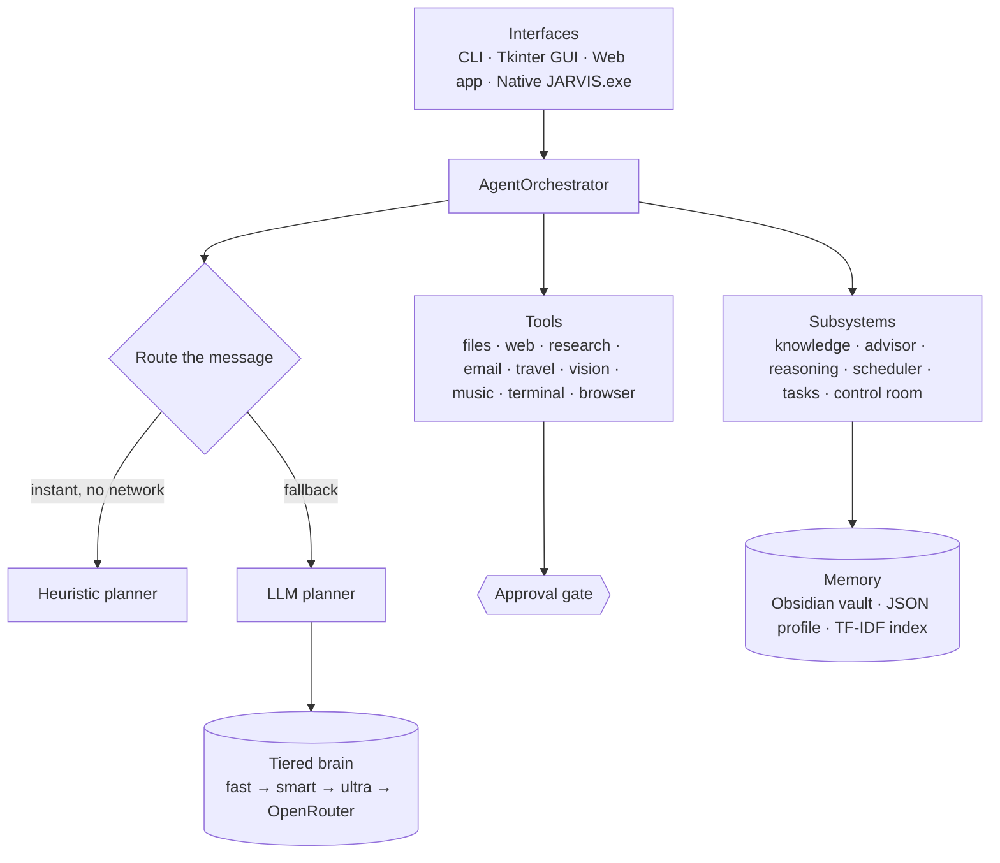
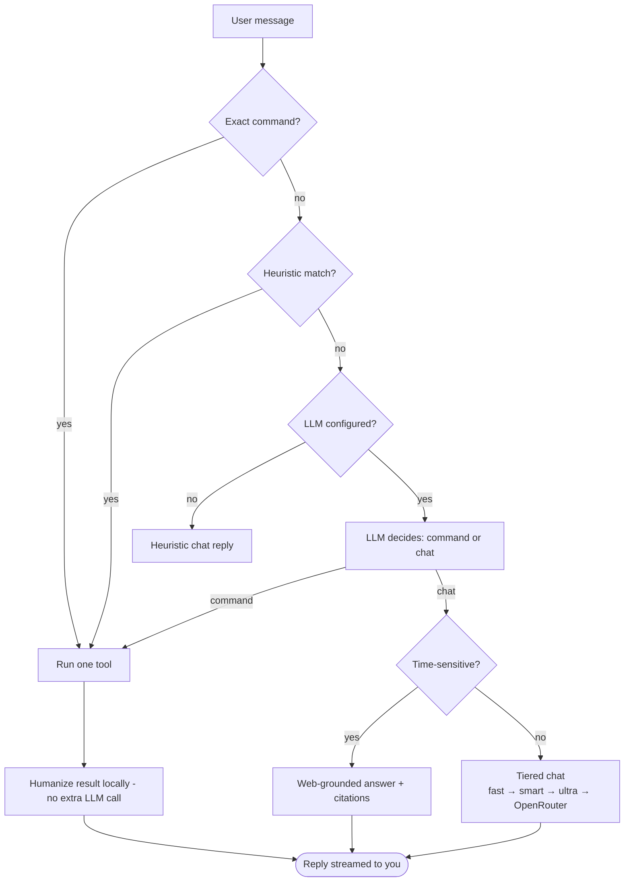

# J.A.R.V.I.S — Local-First Personal Agent

A **local-first, voice-capable** personal laptop assistant (package `laptop_agent`).
It chats, runs safe laptop tools, does file/vision intelligence, web research,
email, an autonomous task layer, and Obsidian-backed memory — all behind an
**approval gate**, with a tiered LLM "brain" that streams replies.

`Python 3.11+` · **zero required dependencies** (heavy features are optional extras) ·
runs fully offline with a heuristic router, smarter with an LLM key · MIT licensed.

> Not an unrestricted autopilot. Anything that can leak data, send messages, run
> commands, move files, or download goes through an explicit approval gate.

---

## Highlights

- 🧠 **Tiered LLM brain** — fast → smart → ultra, with graceful fallback (and optional cross-provider OpenRouter) so chat keeps answering when a tier is busy.
- 🛡️ **Approval gate** — every risky action is risk-classified and confirmed; read-only/local work runs freely.
- 🗂️ **Obsidian memory** — durable, human-readable notes with link-aware retrieval (`ask vault`) and a health `audit`.
- 🤖 **Autonomy** — `solve` (researched advisor), `agent run` (plan→act→observe loop), `autopilot` (safe), scheduler.
- 👁️ **Vision & media** — screen/webcam/image OCR, audio/video transcription, YouTube summaries.
- 🌍 **Free tools, no keys** — real weather, driving distance/trips, maps, places near you.
- 🎙️ **Polished UX** — native desktop window (`JARVIS.exe`), streaming + typewriter replies, real-time voice, a holographic HUD, and web panels (map, trip, vault browser, schedules, agent runs).

---

## Architecture



## How a request flows



---

## Quick start

```powershell
$env:PYTHONPATH = "src"          # only needed if running from source without install
python -m laptop_agent.cli       # interactive terminal
```

| Mode | Command |
|---|---|
| Terminal (CLI) | `python -m laptop_agent.cli` |
| Native desktop app | `python -m laptop_agent.webui --desktop` *(or `laptop-agent-deck`)* |
| Browser tab | `python -m laptop_agent.webui` → http://127.0.0.1:8770 |
| Tkinter GUI | `python -m laptop_agent.gui` |
| Tests | `python -m pytest tests -q` |

Works offline out of the box (heuristic routing). Add an LLM key (below) to unlock
conversation and natural-language routing.

---

## Capabilities

Talk naturally — most of these are reached by plain language; the explicit command is shown for reference.

### 🧠 Chat, reasoning & autonomy
| Capability | How |
|---|---|
| Conversational chat, tier-escalated by complexity | just talk |
| Researched decision advisor | `solve <problem>` *(auto-routes from "should I…", "help me decide…")* |
| Live-news grounding (cited, fresh) | auto on time-sensitive questions |
| Autonomous goal loop (plan→act→observe) | `agent run <goal>` · `agent runs` / `agent last` |
| Unattended **safe** work only | `autopilot <goal>` |
| Parallel subtasks / sequential workflows | `multi a ;; b` · `workflow a ;; b` (retry on failure) |

### 🗂️ Files & documents
| Capability | How |
|---|---|
| Auto-detect & process any file | `process file <path>` |
| Summarize (offline) txt/md/PDF/DOCX/media | `summarize file <path>` |
| Q&A over one file | `ask file <path> about <question>` |
| Per-column spreadsheet stats | `analyze spreadsheet <path>` |
| Scan / search text | `scan files <dir>` · `search files <q> <dir>` |
| Tables · convert · organize (gated) | `extract tables` · `convert file … to …` · `organize folder … [apply]` |

### 👁️ Vision & media
| Capability | How |
|---|---|
| Image OCR | `ocr image <path>` |
| Audio/video transcription (offline) | `transcribe <path>` |
| Understand your screen | `read screen [question]` |
| Webcam vision | `look at webcam [question]` |
| YouTube transcript → summary (+ Q&A) | `summarize youtube <url>` |

### 🧩 Knowledge & memory
| Capability | How |
|---|---|
| Local searchable index (TF-IDF) | `index file <path>` · `recall <q>` · `ask knowledge <q>` |
| Obsidian vault as memory | `notes search <q>` · `read note <name>` · `save note <t> : <body>` |
| Link-aware vault answer | `ask vault <question>` |
| Vault health (orphans/broken/missing summary) | `notes audit` |
| Durable profile facts | `remember <fact>` *(mirrored into the vault)* |

### 🌍 Web, research & travel (free, no key)
| Capability | How |
|---|---|
| Web search (DuckDuckGo, or Brave/Serper/SerpApi) | `web search <q>` |
| Autonomous research + report | `research <topic>` · `research report <topic>` |
| Real weather (Open-Meteo) | `weather <location>` |
| Driving distance/ETA · multi-stop trip | `distance <a> to <b>` · `trip <a> to <b> to <c>` |
| Places near you (IP-located) · map | `around <category>` · `<x> near me` · `map <place\|A to B>` |

### 📬 Email
| Capability | How |
|---|---|
| Draft (mailto) / SMTP send (gated) | `email to <addr> subject <s> body <b>` |
| Inbox read & digest | `email unread` · `email search <q>` · `email digest` |
| Gmail/Outlook OAuth read/draft/send | `email oauth …` / `email api …` *(tokens DPAPI-encrypted)* |

### ⏰ Productivity & system
| Capability | How |
|---|---|
| Job application tracker | `job add <company> [stage]` · `jobs` · `job stage <id> <stage>` |
| Reminders | `remind me to <x> at <when>` · `reminders` |
| Recurring jobs (commands or agent goals) | `schedule <when> :: <command>` · `schedule list` |
| Daily briefing | `briefing` |
| Open apps · music · media keys | `open url <u>` · `play music <path>` |
| Terminal commands (gated, timed) | `run command <cmd>` |
| Browser form inspect / preview / fill (gated) | `inspect forms <url>` · `fill form <url>` |

### 🎨 Interfaces & UX
CLI · Tkinter GUI · **multi-page web app** (header nav + router: Chat · Overview · **Job tracker**, with funnel/trend charts) · native **`JARVIS.exe`** (pywebview, packaged via PyInstaller).
Streaming **and** typewriter reveal · real-time voice (Vosk/Whisper STT + offline TTS) ·
holographic particle-core HUD · adaptive HUD controls (transparency / compact / always-on-top) ·
web panels: **Map**, **Trip planner**, **memory-vault browser**, **Scheduled jobs**, **Agent runs**, live metrics & health pill.

---

## Configuration

Copy `.env.example` → `.env` (gitignored, auto-loaded) and fill in what you need. Everything is optional.

| Group | Key(s) | Notes |
|---|---|---|
| **LLM brain** | `LAPTOP_AGENT_LLM_PROVIDER=openai`, `OPENAI_API_KEY`, `OPENAI_MODEL`, `OPENAI_BASE_URL` | Any OpenAI-compatible API (OpenAI, NVIDIA, …). Leave provider `heuristic` for offline. |
| **Model tiers** | `OPENAI_SMART_MODEL`, `OPENAI_ULTRA_MODEL`, `OPENAI_VISION_MODEL` | Optional; picked automatically by task complexity. |
| **Cross-provider fallback** | `OPENROUTER_API_KEY`, `OPENROUTER_MODEL` | Free [OpenRouter](https://openrouter.ai/keys) safety net when the primary provider is throttled. |
| **Web search** | `SEARCH_PROVIDER`, `SEARCH_API_KEY` (or `BRAVE_API_KEY` / `SERPER_API_KEY` / `SERPAPI_API_KEY`) | No key → DuckDuckGo. Provider inferred from whichever key is set. |
| **Email** | `SMTP_*`, `IMAP_*`, `GOOGLE_CLIENT_*`, `MICROSOFT_CLIENT_*` | Drafts work with no creds; SMTP/IMAP/OAuth unlock send/read. |
| **Memory** | `OBSIDIAN_VAULT` | Path to an Obsidian vault folder used as durable memory. |
| **Speech** | `LAPTOP_AGENT_STT=auto` | `auto` prefers lightweight Vosk if a model is present, else Whisper. |
| **Web server** | `LAPTOP_AGENT_HOST`, `LAPTOP_AGENT_PORT` | Loopback by default — see [Security](#security--deployment). |

### Model tiers

| Tier | Env var | Used for |
|---|---|---|
| fast | `OPENAI_MODEL` | routing + simple turns (kept warm) |
| smart | `OPENAI_SMART_MODEL` | complex questions |
| ultra | `OPENAI_ULTRA_MODEL` | hardest / deep work (long timeout) |
| vision | `OPENAI_VISION_MODEL` | screen + images |
| backup | `OPENROUTER_API_KEY` | cross-provider last resort |

At runtime each turn escalates by complexity and **degrades gracefully**:
`ultra → smart → fast → OpenRouter`. A degraded reply is tagged ("answered with my
faster/backup model") and the busy tier shows in `/api/health` and the status pill.

---

## Security & deployment

Risk-classified approval gate — only **external state changes** and **data egress** are confirmed:

| Risk | Examples |
|---|---|
| none / low | read/search/summarize local files, knowledge recall, vault read/write |
| medium | web search, inbox read, research (one approval covers the fetch fan-out) |
| high | send email, write/convert/move files, downloads, launch apps, browser state changes |
| critical | SMTP/OAuth send, OAuth token exchange, terminal commands |

`autopilot` is restricted to the safe read-only allowlist; `agent run` can act but
risky steps still hit the gate (and are auto-denied in the guarded web UI). Audit
events are written to `.agent_data/audit.jsonl`.

**Deployment posture.** Local-first, single-user. The web server binds to loopback
(`127.0.0.1`) and has **no authentication** — run it on your own machine. Override
`LAPTOP_AGENT_HOST` / `LAPTOP_AGENT_PORT` only if you put your own auth in front.
Secrets live only in a gitignored `.env`; never commit real keys.

---

## Optional extras

Heavy capabilities are opt-in; without an extra, the command returns a clear install hint instead of failing.

```powershell
pip install -e ".[browser,desktop,docs,voice,ocr,transcribe,stt,youtube,metrics,vision,app]"
playwright install chromium    # for browser automation
```

| Extra | Enables |
|---|---|
| `app` | native pywebview desktop window |
| `voice` | text-to-speech + speech recognition |
| `ocr` | image OCR *(needs the Tesseract binary on PATH)* |
| `transcribe` / `stt` | Whisper *(needs ffmpeg)* / lightweight Vosk |
| `docs` | PDF/DOCX reading |
| `browser` | Playwright form inspect/fill |
| `desktop` | screenshots, app/media-key control |
| `youtube` · `metrics` · `vision` | transcripts · CPU/GPU stats · webcam |

---

## Project layout

```text
src/laptop_agent/
  agents/orchestrator.py   Core router: text → one tool or a streamed chat reply
  planner/                 Heuristic (instant) + OpenAI-compatible (LLM) routers
  tools/                   files, web, research, email, travel, transcribe, webcam,
                           music, weather, youtube, obsidian, browser, desktop, terminal
  advisor.py  reasoning.py Problem-solver + autonomous plan/act/observe loop
  knowledge.py  memory.py  TF-IDF index + JSON profile memory
  scheduler.py  tasks.py   Recurring jobs · parallel/sequential run history
  safety.py  audit.py      Approval gate + JSONL audit log
  model_status.py  health.py  Per-tier reachability + system self-check
  cli.py  gui.py  webui.py  Three front ends (CLI, Tkinter, web/native)
tests/                     Dependency-free unit tests (offline)
```

---

## License

Released under the [MIT License](LICENSE).
