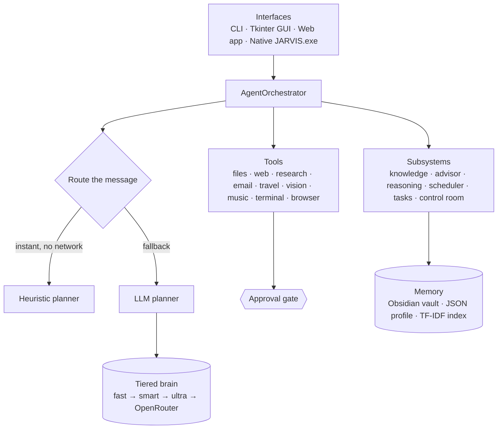
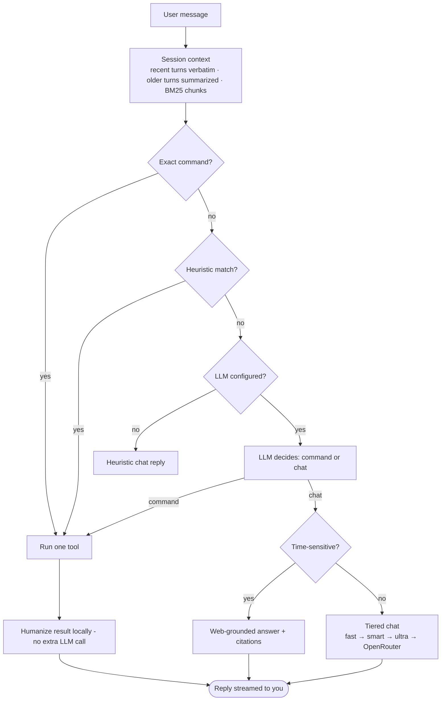

# J.A.R.V.I.S — Local-First Personal Agent

A **local-first, voice-capable** personal laptop assistant (package `laptop_agent`).
It chats, runs safe laptop tools, does file/vision intelligence, web research,
email, an autonomous task layer, and Obsidian-backed memory — all behind an
**approval gate**, with a tiered LLM "brain" that streams replies.

`Python 3.11+` · **zero required dependencies** (heavy features are optional extras) ·
runs fully offline with a heuristic router, smarter with an LLM key · MIT licensed.

> Not an unrestricted autopilot. Anything that can leak data, send messages, run
> commands, move files, or download goes through an explicit approval gate — in the
> web app it puts an approval card in front of you and waits. No answer means no.

---

## Highlights

- 🧠 **Tiered LLM brain** — fast → smart → ultra, with graceful fallback (and optional cross-provider OpenRouter) so chat keeps answering when a tier is busy.
- 🛡️ **Approval gate** — every risky action is risk-classified and confirmed in whichever interface you are using; read-only/local work runs freely. A timeout denies.
- 🗂️ **Obsidian memory** — durable, human-readable notes with link-aware retrieval (`ask vault`) and a health `audit`.
- 🤖 **Autonomy** — `solve` (researched advisor), `agent run` (plan→act→observe loop), `autopilot` (safe), scheduler.
- 👁️ **Vision & media** — screen/webcam vision, **layout-aware OCR** (hosted `nemotron-parse`, falling back to Tesseract offline), audio/video transcription, YouTube summaries.
- 🔢 **Exact arithmetic** — a real parser, not the model: `67458363*37834872` is `2,552,278,529,434,536`, and `754/86982` keeps its exact fraction.
- 🌍 **Free tools, no keys** — real weather, driving distance/trips, maps, places near you.
- 🎙️ **Polished UX** — native desktop window (`JARVIS.exe`), streaming + typewriter replies, real-time voice, a calm dark workspace built around the animated orb, and a System-status drawer with panels (map, trip, vault browser, schedules, agent runs).

---

## Architecture


```mermaid
flowchart TD
  UI["Interfaces<br/>CLI · Tkinter GUI · Web app · Native JARVIS.exe"] --> ORC[AgentOrchestrator]
  ORC --> ROUTER{Route the message}
  ROUTER -->|instant, no network| HEUR[Heuristic planner]
  ROUTER -->|fallback| LLM[LLM planner]
  LLM --> BRAIN[("Tiered brain<br/>fast → smart → ultra → OpenRouter")]
  ORC --> TOOLS["Tools<br/>files · web · research · email · travel · vision · music · terminal · browser"]
  ORC --> SUBS["Subsystems<br/>knowledge · advisor · reasoning · scheduler · tasks · control room"]
  TOOLS --> GATE{{Approval gate}}
  SUBS --> MEM[("Memory<br/>Obsidian vault · JSON profile · TF-IDF index")]
```

## How a request flows


```mermaid
flowchart TD
  A[User message] --> CTX["Session context<br/>recent turns verbatim · older turns summarized · BM25 chunks"]
  CTX --> B{Exact command?}
  B -->|yes| RUN[Run one tool]
  B -->|no| C{Heuristic match?}
  C -->|yes| RUN
  C -->|no| D{LLM configured?}
  D -->|no| H0[Heuristic chat reply]
  D -->|yes| E["LLM decides: command or chat"]
  E -->|command| RUN
  E -->|chat| F{Time-sensitive?}
  F -->|yes| WEB[Web-grounded answer + citations]
  F -->|no| G["Tiered chat<br/>fast → smart → ultra → OpenRouter"]
  RUN --> HUM[Humanize result locally - no extra LLM call]
  HUM --> OUT([Reply streamed to you])
  WEB --> OUT
  G --> OUT
```

---

## Quick start

```powershell
$env:PYTHONPATH = "src"          # only needed if running from source without install
python -m laptop_agent.cli       # interactive terminal
```

| Mode | Command |
|---|---|
| Terminal (CLI) | `python -m laptop_agent.cli` |
| Native desktop app | `python -m laptop_agent.webui --desktop` *(or `laptop-agent-deck`)* |
| Browser tab | `python -m laptop_agent.webui` → http://127.0.0.1:8770 |
| Tkinter GUI | `python -m laptop_agent.gui` |
| Tests | `python -B tests/run_tests.py` |

Works offline out of the box (heuristic routing). Add an LLM key (below) to unlock
conversation and natural-language routing.

---

## Capabilities

Talk naturally — most of these are reached by plain language; the explicit command is shown for reference.

### 🧠 Chat, reasoning & autonomy
| Capability | How |
|---|---|
| Conversational chat, tier-escalated by complexity | just talk |
| Follow-ups that lean on the conversation ("build an ERD for this", "make it shorter") | automatic — the whole session is chunked, ranked and budgeted into every model prompt (chat, agent, advisor) |
| Researched decision advisor | `solve <problem>` *(auto-routes from "should I…", "help me decide…")* |
| Live-news grounding (cited, fresh) | auto on time-sensitive questions |
| Autonomous goal loop (plan→act→observe) | `agent run <goal>` · `agent runs` / `agent last` |
| Unattended **safe** work only | `autopilot <goal>` |
| Parallel subtasks / sequential workflows | `multi a ;; b` · `workflow a ;; b` (retry on failure) |
| Exact arithmetic (never the model) | `calculate <expression>`, or just "what is 754/86982" |

### 🗂️ Files & documents
| Capability | How |
|---|---|
| Auto-detect & process any file | `process file <path>` |
| Summarize (offline) txt/md/PDF/DOCX/media | `summarize file <path>` |
| Q&A over one file | `ask file <path> about <question>` |
| Per-column spreadsheet stats | `analyze spreadsheet <path>` |
| Scan / search text | `scan files <dir>` · `search files <q> <dir>` |
| Tables · convert · organize (gated) | `extract tables` · `convert file … to …` · `organize folder … [apply]` |

### 👁️ Vision & media
| Capability | How |
|---|---|
| Generate a picture | `image <description>`, or "draw me a picture of …"; **Save** it from the reply |
| Write a document | `document <request> as pdf|word|markdown`, or "write a brief on X as a pdf" |
| Image & document OCR | `ocr image <path>` — hosted `nemotron-parse` keeps headings, tables and reading order; falls back to Tesseract offline (`LAPTOP_AGENT_OCR`) |
| Audio/video transcription | `transcribe <path>` — hosted Parakeet (~1s) or offline Vosk/Whisper |
| Understand your screen | `read screen [question]` |
| Webcam vision | `look at webcam [question]` |
| YouTube transcript → summary (+ Q&A) | `summarize youtube <url>` |
| Play a song or video | `play music <song, artist, path or url>` — resolves the top YouTube hit and opens the video itself, not a page of search results |

### 🧩 Knowledge & memory
| Capability | How |
|---|---|
| Local searchable index (TF-IDF) | `index file <path>` · `recall <q>` · `ask knowledge <q>` |
| Obsidian vault as memory | `notes search <q>` · `read note <name>` · `save note <t> : <body>` |
| Link-aware vault answer | `ask vault <question>` |
| Vault health (orphans/broken/missing summary) | `notes audit` |
| Durable profile facts | `remember <fact>` *(mirrored into the vault)* |

### 🌍 Web, research & travel (free, no key)
| Capability | How |
|---|---|
| Web search (DuckDuckGo, or Brave/Serper/SerpApi) | `web search <q>` |
| Autonomous research + report | `research <topic>` · `research report <topic>` |
| Real headlines with article text | `news [topic]` — publisher feeds plus Google News, no key |
| Real weather (Open-Meteo) | `weather <location>` |
| Driving distance/ETA · multi-stop trip | `distance <a> to <b>` · `trip <a> to <b> to <c>` |
| Places near you (IP-located) · map | `around <category>` · `<x> near me` · `map <place\|A to B>` |

### 📬 Email
| Capability | How |
|---|---|
| Draft (mailto) / SMTP send (gated) | `email to <addr> subject <s> body <b>` |
| Inbox read & digest | `email unread` · `email search <q>` · `email digest` |
| Gmail/Outlook OAuth read/draft/send | `email oauth …` / `email api …` *(tokens DPAPI-encrypted)* |

### ⏰ Productivity & system
| Capability | How |
|---|---|
| Job application tracker | `job add <company> [stage]` · `jobs` · `job stage <id> <stage>` |
| Daily Jobright lead pull | `jobright pull` (browser extra) — scrapes recommendations, filters to early-career fit (drops senior/PhD/clearance/no-sponsorship/off-target), imports at a `lead` stage. Schedule via `schedule daily at 09:00 :: jobright pull` |
| Live pipeline dashboard | Pipeline page (`#/pipeline`): stage board with live **ATS scores**, **Pull from Jobright** + **Clear leads**, and per-job **Tailor → PDF** |
| Resume CoPilot (ATS + tailoring) | Job tracker page → "Tailor an application": ATS score, missing keywords, grounded bullets, cover letter, interview pack |
| Grounded resume tailoring → PDF | Pipeline page → set base resume, then **Tailor** any lead: a one-page resume (template-driven exact format, grounded skills + real GitHub project links, no GPA), downloadable as **PDF** (rendered via Chromium, no LaTeX needed) |
| Reminders | `remind me to <x> at <when>` · `reminders` |
| Recurring jobs (commands or agent goals) | `schedule <when> :: <command>` · `schedule list` |
| Daily briefing | `briefing` |
| Open apps · music · media keys | `open url <u>` · `play music <path>` |
| Terminal commands (gated, timed) | `run command <cmd>` |
| Browser form inspect / preview / fill (gated) | `inspect forms <url>` · `fill form <url>` |

### 🎨 Interfaces & UX
CLI · Tkinter GUI · **multi-page web app** (header nav + router: Chat · Overview · **Job tracker** · **Pipeline**, with funnel/trend charts + a live job-search board) · native **`JARVIS.exe`** (pywebview, packaged via PyInstaller).
Streaming **and** typewriter reveal · real-time voice (Vosk/Whisper STT + offline TTS, barge-in + Interrupt) ·
a calm, premium dark workspace: slim chat rail, the animated particle **orb** as the single focal point, a wide quiet conversation column, and a **System status** drawer holding model/usage/vault diagnostics plus the **Map**, **Trip planner**, **memory-vault browser**, **Scheduled jobs** and **Agent runs** panels · settings popover (compact / always-on-top / transparency) · status pill + per-reply model/latency line.

---

## Configuration

Copy `.env.example` → `.env` (gitignored, auto-loaded) and fill in what you need. Everything is optional.

| Group | Key(s) | Notes |
|---|---|---|
| **LLM brain** | `LAPTOP_AGENT_LLM_PROVIDER=openai`, `OPENAI_API_KEY`, `OPENAI_MODEL`, `OPENAI_BASE_URL` | Any OpenAI-compatible API (OpenAI, NVIDIA, …). Leave provider `heuristic` for offline. |
| **Model tiers** | `OPENAI_SMART_MODEL`, `OPENAI_ULTRA_MODEL`, `OPENAI_VISION_MODEL` | Optional; picked automatically by task complexity. |
| **Reasoning budget** | `OPENAI_REASONING_BUDGET` | Chain-of-thought token budget for an NVIDIA reasoning ultra tier (default 16384; kept internal). |
| **Job search** | `JOBRIGHT_EMAIL`, `JOBRIGHT_PASSWORD`, `JOBRIGHT_MAX_YEARS`, `JOBRIGHT_MIN_MATCH` | Jobright login (session-cached after first login) + lead filtering (max experience years, min resume match). |
| **Cross-provider fallback** | `OPENROUTER_API_KEY`, `OPENROUTER_MODEL` | Free [OpenRouter](https://openrouter.ai/keys) safety net when the primary provider is throttled. |
| **Web search** | `SEARCH_PROVIDER`, `SEARCH_API_KEY` (or `BRAVE_API_KEY` / `SERPER_API_KEY` / `SERPAPI_API_KEY`) | No key → DuckDuckGo. Provider inferred from whichever key is set. |
| **Email** | `SMTP_*`, `IMAP_*`, `GOOGLE_CLIENT_*`, `MICROSOFT_CLIENT_*` | Drafts work with no creds; SMTP/IMAP/OAuth unlock send/read. |
| **Memory** | `OBSIDIAN_VAULT` | Path to an Obsidian vault folder used as durable memory. |
| **Speech** | `LAPTOP_AGENT_STT=auto`, `RIVA_ASR_FUNCTION_ID` | `auto` prefers hosted Parakeet, then lightweight Vosk if a model is present, else Whisper. Riva selects a model by **function id**, never a model name. |
| **OCR** | `LAPTOP_AGENT_OCR=auto` | `auto` uses hosted `nemotron-parse` when a key is present and falls back to Tesseract offline; `parse` / `tesseract` pin one. |
| **Web server** | `LAPTOP_AGENT_HOST`, `LAPTOP_AGENT_PORT` | Loopback by default — see [Security](#security--deployment). |

### Model tiers

| Tier | Env var | Used for |
|---|---|---|
| fast | `OPENAI_MODEL` | routing + simple turns (kept warm) |
| smart | `OPENAI_SMART_MODEL` | complex questions |
| ultra | `OPENAI_ULTRA_MODEL` | hardest / deep work (long timeout); NVIDIA reasoning models think first, and `OPENAI_REASONING_BUDGET` sizes the room left for the answer. The budget is deliberately **not** sent to the endpoint — NVIDIA's V2 model runner rejects it and every ultra turn 400s |
| vision | `OPENAI_VISION_MODEL` | screen + images |
| image | `OPENAI_IMAGE_MODEL` | text-to-image (FLUX, own key + base URL; `OPENAI_IMAGE_FALLBACK_MODEL` stands in when it is queued) |
| backup | `OPENROUTER_API_KEY` | cross-provider last resort |

At runtime each turn escalates by complexity and **degrades gracefully**:
`ultra → smart → fast → OpenRouter`. A degraded reply is tagged ("answered with my
faster/backup model") and the busy tier shows in `/api/health` and the status pill.

---

## Security & deployment

Risk-classified approval gate — only **external state changes** and **data egress** are confirmed:

| Risk | Examples |
|---|---|
| none / low | read/search/summarize local files, knowledge recall, vault read/write |
| medium | web search, inbox read, research (one approval covers the fetch fan-out) |
| high | send email, write/convert/move files, downloads, launch apps, browser state changes |
| critical | SMTP/OAuth send, OAuth token exchange, terminal commands |

`autopilot` is restricted to the safe read-only allowlist; `agent run` can act but
risky steps still hit the gate. In the web app a high-risk action raises an approval
card naming the exact action and waits: an answer must match that request's id, an id
is single-use, and a timeout denies — silence is never consent. With no interface
connected to answer, the action is denied immediately rather than left hanging. Audit
events are written to `.agent_data/audit.jsonl`.

**Deployment posture.** Local-first, single-user. The web server binds to loopback
(`127.0.0.1` or `localhost`) with origin checks and a per-process browser mutation
token. It has no user accounts or remote-access support. Keep the configured
`LAPTOP_AGENT_PORT` stable for browser history.
Secrets live only in a gitignored `.env`; never commit real keys.

---

## Optional extras

Heavy capabilities are opt-in; without an extra, the command returns a clear install hint instead of failing.

```powershell
pip install -e ".[browser,desktop,docs,voice,ocr,transcribe,stt,youtube,metrics,vision,app]"
playwright install chromium    # for browser automation
```

| Extra | Enables |
|---|---|
| `app` | native pywebview desktop window |
| `voice` | text-to-speech + speech recognition |
| `ocr` | image OCR *(needs the Tesseract binary on PATH)* |
| `transcribe` / `stt` | Whisper *(needs ffmpeg)* / lightweight Vosk |
| `docs` | PDF/DOCX reading (pdfplumber preferred for clean ligatures/spacing, pypdf fallback) |
| `browser` | Playwright form inspect/fill · Jobright lead scraper · resume-to-PDF rendering |
| `desktop` | screenshots, app/media-key control |
| `youtube` · `metrics` · `vision` | transcripts · CPU/GPU stats · webcam |

---

## Project layout

```text
src/laptop_agent/
  agents/orchestrator.py   Core router: text → one tool or a streamed chat reply
  planner/                 Heuristic (instant) + OpenAI-compatible (LLM) routers
  tools/                   files, web, research, email, travel, transcribe, webcam,
                           music, weather, youtube, obsidian, browser, desktop, terminal,
                           imagegen (text-to-image),
                           jobright (lead scraper), resume_pdf (HTML→PDF via Chromium)
  copilot.py  jobs.py      Resume CoPilot (ATS + grounded template resume) + job pipeline
  advisor.py  reasoning.py Problem-solver + autonomous plan/act/observe loop
  knowledge.py  memory.py  TF-IDF index + JSON profile memory
  scheduler.py  tasks.py   Recurring jobs · parallel/sequential run history
  safety.py  audit.py      Approval gate + JSONL audit log
  model_status.py  health.py  Per-tier reachability + system self-check
  cli.py  gui.py  webui.py  Three front ends (CLI, Tkinter, web/native)
  webui_page.py            The web UI document (markup + CSS + JS), served by webui.py
tests/                     Dependency-free unit tests (offline)
```

---

## License

Released under the [MIT License](LICENSE).


## Reliability and review

See [REVIEW_REPORT.md](REVIEW_REPORT.md) for the feature inventory, baseline findings,
remediation evidence, and remaining limits.

- The web/native app is a single-user loopback service. Browser mutation requests
  require its per-process token and matching origin. High-risk actions require an
  interactive CLI/Tkinter approval; they are blocked in web/native guarded mode.
- Native chat history uses a persistent webview profile and the configured port
  (default 8770). Keep that port stable. If it is occupied, close the other local
  instance before restarting. Old histories from random-port releases are not migrated.
- Stop cancels the backend request and prevents subsequent steps. Active HTTP model
  streams are interrupted where their socket is available. A tool already inside a
  blocking external call may finish or time out first; completed actions are not undone.
- JSON stores use atomic replacement, a previous-version `.bak`, and file locks.
  Malformed JSON is preserved as `.corrupt-*`; health reports recovery warnings.
  Review the preserved copy before deciding what to restore.
- Schedules run only while the server is running. Due work is claimed durably before
  execution. A crash leaves a `running` claim to avoid an uncertain duplicate action;
  after checking its effects, disable/re-enable the schedule to recover it.
- Application counts exclude unsubmitted leads and retain the furthest stage reached.
  Pre-existing rejected records cannot recover history that was never stored.
- Resume keyword scores are estimates, not employer ATS predictions. Export tailoring
  selects exact source excerpts and rejects unsupported facts, malformed content and
  unlisted repository links. Review excerpt grouping before use. General cover-letter
  and interview drafts still require factual review.
- The Pipeline page exposes contact/certification overrides. Changing the base resume,
  profile, or tailoring invalidates old exports. PDF export requires Playwright and
  publishes only verified single-page Letter output; shorten content if it overflows.
- Reminders list local due times; they do not create OS notifications. Jobright, email,
  model providers, microphone/camera hardware and packaged installers need their own
  configured integration checks.

The standard runner ignores personal `.env` configuration, uses temporary data and
blocks external Python socket connections. Optional browser checks need Playwright,
Chromium and pypdf:

```powershell
python -m pip install playwright pypdf
python -m playwright install chromium
$env:JARVIS_BROWSER_TESTS = "1"
python -B tests/run_tests.py test_browser_regressions.py
```

On Linux/macOS, prefix the last command with `JARVIS_BROWSER_TESTS=1`.
The CI workflow runs offline tests on Windows/Linux and a separate Chromium job.
