# J.A.R.V.I.S — Local-First Personal Agent

[](https://github.com/JeevanReddy0828/Personal-AI-Agent-Assistant/actions/workflows/ci.yml)


A **local-first, voice-capable** personal laptop assistant (package `laptop_agent`).
It chats, runs safe laptop tools, reads files, images and screens, researches the web,
handles email, keeps an Obsidian-backed memory, and runs an autonomous task layer — all
behind an **approval gate**, with a tiered LLM "brain" that streams replies.

`Python 3.11+` · **zero required dependencies** (heavy features are optional extras) ·
works offline with a heuristic router, smarter with an LLM key · MIT licensed.

> Not an unrestricted autopilot. Anything that can leak data, send messages, run
> commands, move files, or download goes through an explicit approval gate — in the
> web app it puts an approval card in front of you and waits. No answer means no.

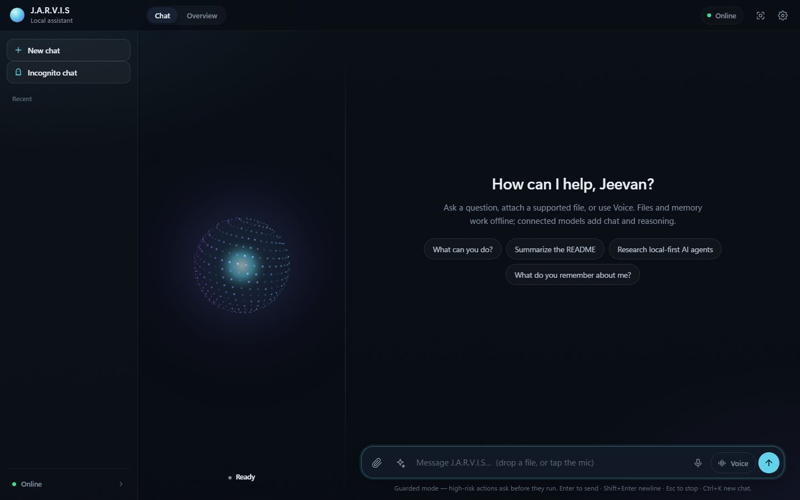

---

## Contents

[Screenshots](#screenshots) · [Highlights](#highlights) · [Architecture](#architecture) ·
[How a request flows](#how-a-request-flows) · [Models](#models) · [Quick start](#quick-start) ·
[Capabilities & commands](#capabilities--commands) · [Voice](#voice) ·
[Accounts & sign-in](#accounts--sign-in) · [Security & approvals](#security--approvals) ·
[Configuration](#configuration) · [Optional extras](#optional-extras) · [Web API](#web-api) ·
[Project layout](#project-layout) · [Testing & CI](#testing--ci) ·
[Packaging](#packaging-jarvisexe) · [Reliability notes](#reliability-notes)

---

## Screenshots

<table>
<tr>
<td width="50%">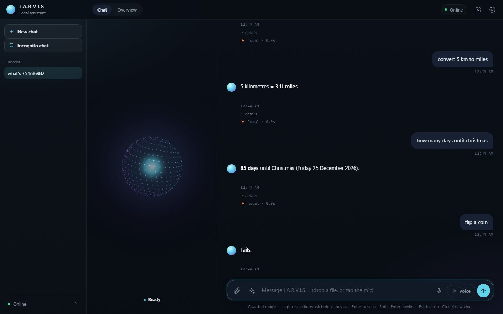<br>
<sub><b>Instant, local answers.</b> Exact fractions, unit conversions, dates and coin flips are computed on the laptop, not guessed by a model (<code>local · 0.0s</code>).</sub></td>
<td width="50%">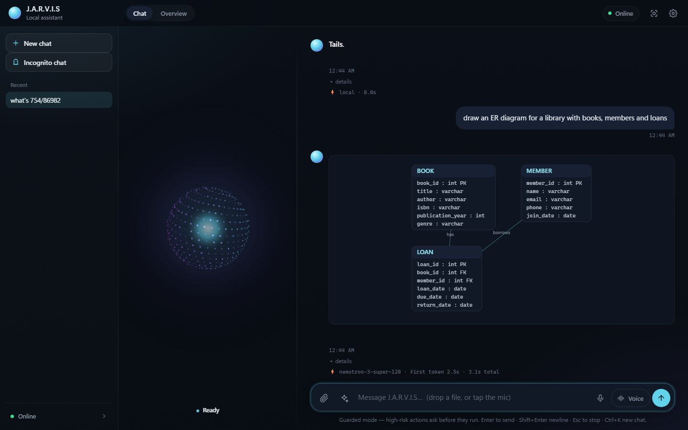<br>
<sub><b>Diagrams are drawn, not described.</b> A Mermaid ER diagram from the chat model, rendered inline, with the model and time to first token underneath.</sub></td>
</tr>
<tr>
<td width="50%">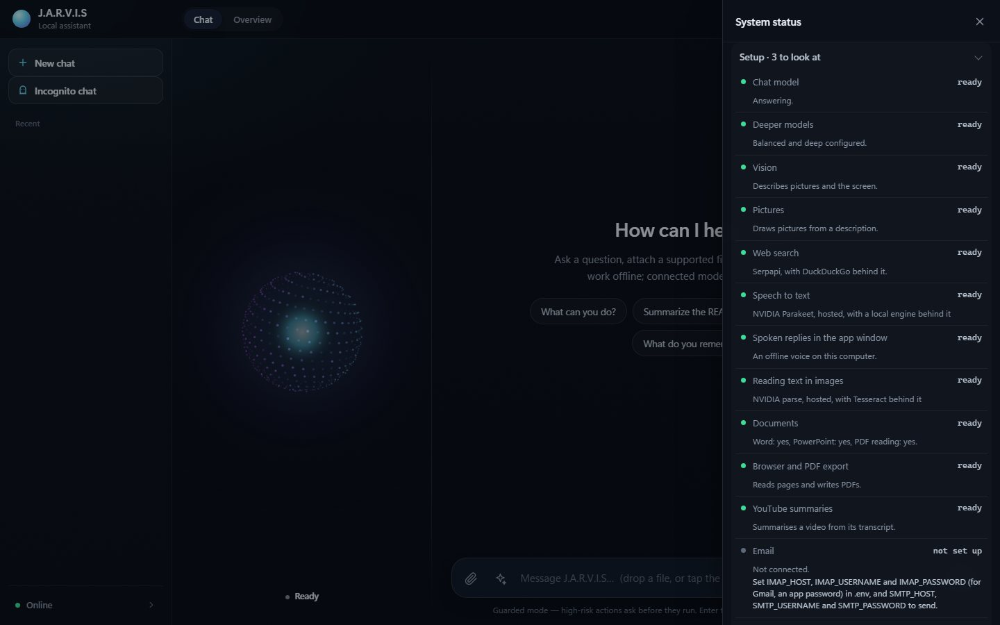<br>
<sub><b>System status → Setup.</b> Every capability as ready / off / missing / busy / broken, with the exact setting or install command that fixes it.</sub></td>
<td width="50%">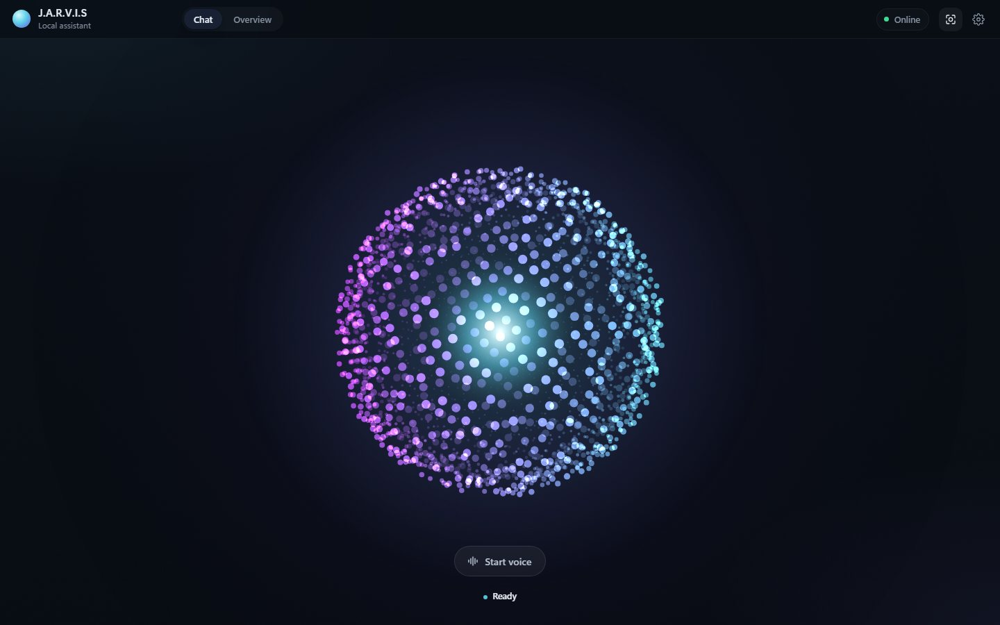<br>
<sub><b>Orb focus.</b> The chat steps aside and the orb fills the window, with its own voice toggle. Esc comes back.</sub></td>
</tr>
<tr>
<td width="50%" align="center">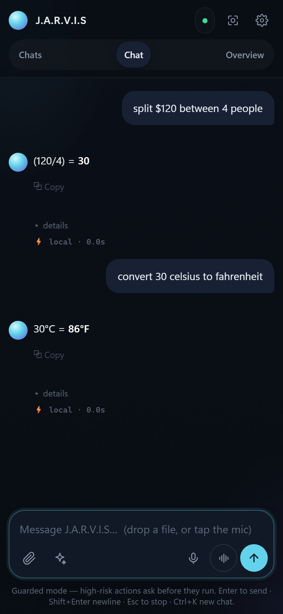<br>
<sub><b>On a phone</b> (LAN mode, behind a passcode or an account).</sub></td>
<td width="50%" align="center">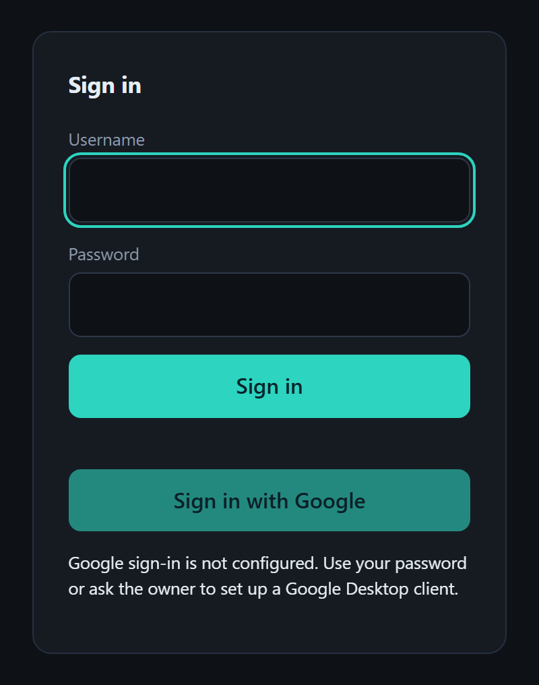<br>
<sub><b>Optional accounts.</b> Password or Google sign-in; the app and its API token are never sent to anyone signed out.</sub></td>
</tr>
</table>

---

## Highlights

- ⚡ **Most turns never wait on a model to decide what to do.** Over 300 recorded turns, 92% were routed without one (77% at 0 ms, 15% by the instant router at ~2 ms); only 8% needed the LLM router. Arithmetic, conversions, dates, time zones, timers, lists, reminders and random draws are computed locally.
- 🧠 **Tiered LLM brain** — NVIDIA Nemotron fast → smart → ultra, then an optional OpenRouter backup. It tells a *busy* model (retry in 60 s) from a *broken* one (wrong key, retired model id: skipped, remembered across restarts, and named in Setup).
- 🛡️ **Approval gate** — every risky action is risk-classified and confirmed in whichever interface you are using; read-only/local work runs freely. A timeout denies.
- 👥 **Optional accounts** — `dev` and `personal` roles, scrypt passwords, server-side sessions bound to the credentials they were granted under, and Google sign-in.
- 🎙️ **Voice** — hands-free conversation that starts speaking the first sentence while the rest streams, barge-in that tells your voice from its own, hosted Parakeet speech-to-text (~1 s) with offline fallback, and voice notes.
- 🎨 **Real output, not just text** — pictures (FLUX), PDF / Word / PowerPoint / Markdown documents, slide decks, and Mermaid diagrams drawn in the reply.
- 🗂️ **Obsidian memory** — durable, human-readable notes with link-aware retrieval (`ask vault`) and a health `audit`; a local knowledge index fusing TF-IDF with embeddings.
- 🤖 **Autonomy** — `solve` (researched advisor), `agent run` (plan → act → observe loop), `autopilot` (safe allowlist only), and a scheduler.
- 👁️ **Vision & media** — screen and webcam vision, layout-aware OCR (hosted `nemotron-parse`, Tesseract offline), audio/video transcription, YouTube summaries.
- 🌍 **Free tools, no keys** — real weather, headlines with article text, driving distance and multi-stop trips, maps, places near you.
- 🩺 **Observable** — a Setup panel, per-turn latency traces, a log of every swallowed failure, and a routing self-check that can actually fail.
- 🖥️ **Polished UX** — native desktop window (`JARVIS.exe`), streaming and typewriter replies, a calm dark workspace built around the animated orb, a phone layout, and a System-status drawer with map, trip, vault, schedule and agent-run panels.

---

## Architecture

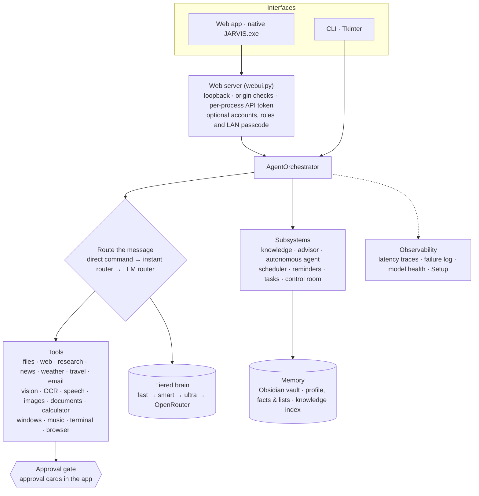
```mermaid
flowchart TD
  subgraph Interfaces
    APP["Web app · native JARVIS.exe"]
    TERM["CLI · Tkinter"]
  end
  APP --> SRV["Web server (webui.py)<br/>loopback · origin checks · per-process API token<br/>optional accounts, roles and LAN passcode"]
  SRV --> ORC[AgentOrchestrator]
  TERM --> ORC
  ORC --> ROUTE{"Route the message<br/>direct command → instant router → LLM router"}
  ROUTE --> TOOLS["Tools<br/>files · web · research · news · weather · travel · email<br/>vision · OCR · speech · images · documents · calculator<br/>windows · music · terminal · browser"]
  ROUTE --> BRAIN[("Tiered brain<br/>fast → smart → ultra → OpenRouter")]
  ORC --> SUBS["Subsystems<br/>knowledge · advisor · autonomous agent<br/>scheduler · reminders · tasks · control room"]
  TOOLS --> GATE{{"Approval gate<br/>approval cards in the app"}}
  SUBS --> MEM[("Memory<br/>Obsidian vault · profile, facts & lists · knowledge index")]
  ORC -.-> OBS["Observability<br/>latency traces · failure log · model health · Setup"]
```

## How a request flows

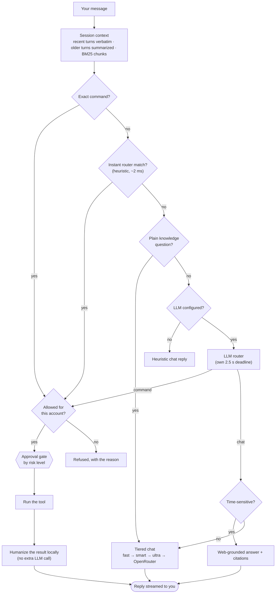
```mermaid
flowchart TD
  A[Your message] --> CTX["Session context<br/>recent turns verbatim · older turns summarized · BM25 chunks"]
  CTX --> B{"Exact command?"}
  B -->|yes| LIM{"Allowed for<br/>this account?"}
  B -->|no| C{"Instant router match?<br/>(heuristic, ~2 ms)"}
  C -->|yes| LIM
  C -->|no| Q{"Plain knowledge<br/>question?"}
  Q -->|yes| G
  Q -->|no| D{LLM configured?}
  D -->|no| H0[Heuristic chat reply]
  D -->|yes| E["LLM router<br/>(own 2.5 s deadline)"]
  E -->|command| LIM
  E -->|chat| F{Time-sensitive?}
  LIM -->|yes| GATE{{"Approval gate<br/>by risk level"}}
  LIM -->|no| REF[Refused, with the reason]
  GATE --> RUN[Run the tool]
  RUN --> HUM["Humanize the result locally<br/>(no extra LLM call)"]
  F -->|yes| WEB[Web-grounded answer + citations]
  F -->|no| G["Tiered chat<br/>fast → smart → ultra → OpenRouter"]
  HUM --> OUT([Reply streamed to you])
  WEB --> OUT
  G --> OUT
```

Two requests in one message ("set a timer for 5 minutes and remind me to call mom at 6pm")
are split only where every part starts like a request and routes on its own, and
a reply to the assistant's own question ("How long should the timer run?" → "10 minutes")
completes the original request.

---

## Models

What this install runs, and what each role falls back to. Every hosted model is reached
through an OpenAI-compatible API (NVIDIA's `integrate.api.nvidia.com` here), so any
provider with that API works.

| Role | Model in use | Set with | Notes |
|---|---|---|---|
| Fast tier — routing + simple chat | `nvidia/nemotron-3-super-120b-a12b` | `OPENAI_MODEL` | Kept warm by a background ping; 0.5–1.5 s per chat turn measured |
| Smart tier — complex questions | `nvidia/nemotron-3-super-120b-a12b` | `OPENAI_SMART_MODEL` | Optional |
| Ultra tier — deepest work | `nvidia/nemotron-3-ultra-550b-a55b` | `OPENAI_ULTRA_MODEL` | A reasoning model: thinks first (kept internal), ~20 s |
| Vision — screen and images | `meta/llama-3.2-11b-vision-instruct` | `OPENAI_VISION_MODEL` | Image attachments go vision-first, OCR as fallback |
| Pictures (text-to-image) | `black-forest-labs/flux.2-klein-4b` | `OPENAI_IMAGE_MODEL` | Default; ~2 s. Its own host (`ai.api.nvidia.com/v1/genai`) and optional fallback model |
| Embeddings — semantic recall | `nvidia/nemotron-3-embed-1b` | `OPENAI_EMBED_MODEL` | Default. Asymmetric: documents embed as `passage`, questions as `query` |
| OCR — text in images | `nvidia/nemotron-parse` | `LAPTOP_AGENT_OCR=auto` | Keeps headings, tables and reading order; Tesseract offline |
| Speech-to-text | NVIDIA Riva **Parakeet** (`parakeet-tdt-0.6b-v2`) | `LAPTOP_AGENT_STT=auto` | gRPC, ~1 s with punctuation; falls back to **Vosk** (~50 MB, offline) or **Whisper** |
| Text-to-speech | Browser voice · offline `pyttsx3` | — | The native window speaks through `/api/tts` |
| Backup chat | `openai/gpt-oss-120b:free` via OpenRouter | `OPENROUTER_API_KEY`, `OPENROUTER_MODEL` | Default; only tried after every primary tier |

### The model ladder

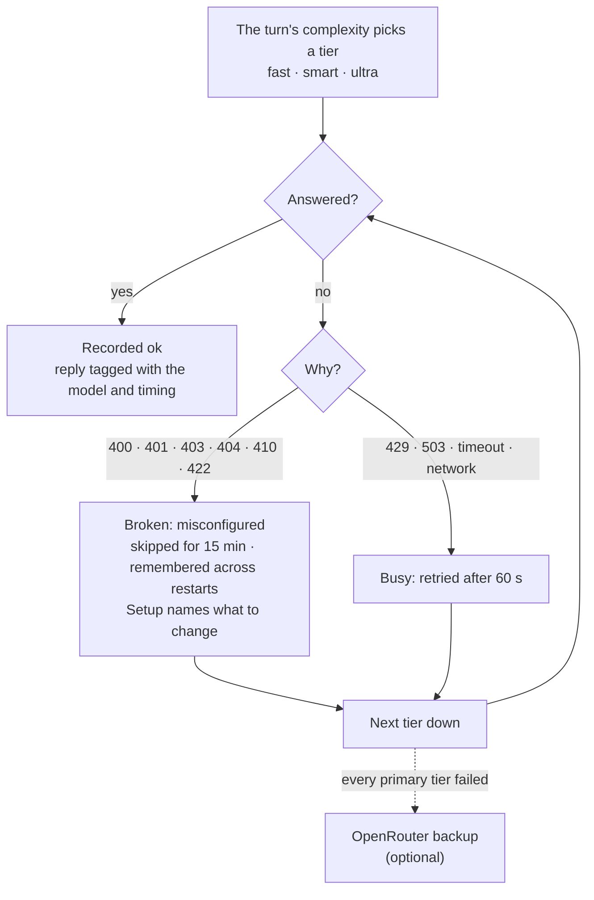
```mermaid
flowchart TD
  T["The turn's complexity picks a tier<br/>fast · smart · ultra"] --> TRY{Answered?}
  TRY -->|yes| OK["Recorded ok<br/>reply tagged with the model and timing"]
  TRY -->|no| WHY{Why?}
  WHY -->|"400 · 401 · 403 · 404 · 410 · 422"| BROKEN["Broken: misconfigured<br/>skipped for 15 min · remembered across restarts<br/>Setup names what to change"]
  WHY -->|"429 · 503 · timeout · network"| BUSY["Busy: retried after 60 s"]
  BROKEN --> DOWN[Next tier down]
  BUSY --> DOWN
  DOWN --> TRY
  DOWN -.->|every primary tier failed| OR["OpenRouter backup<br/>(optional)"]
```

A degraded reply says so ("my smart model was busy"), and `/api/health`, the status pill
and Setup show which tier is busy and which is broken. The ultra tier's
`OPENAI_REASONING_BUDGET` only sizes the answer locally; it is deliberately never sent,
because NVIDIA's V2 runner rejects it with a 400 on every turn.

---

## Quick start

```powershell
pip install -e .                 # zero runtime dependencies
python -m laptop_agent.webui     # → http://127.0.0.1:8770
```

| Mode | Command |
|---|---|
| Browser tab | `python -m laptop_agent.webui` → http://127.0.0.1:8770 |
| Native desktop app | `python -m laptop_agent.webui --desktop` *(or `laptop-agent-deck`)* |
| Terminal (CLI) | `python -m laptop_agent.cli` *(or `laptop-agent`)* |
| Tkinter dashboard | `python -m laptop_agent.dashboard` *(or `laptop-agent-dashboard`)* |
| Tests | `python -B tests/run_tests.py` |

Running from a source checkout without installing? Set `$env:PYTHONPATH = "src"` first.

It works offline out of the box (heuristic routing). To add conversation and
natural-language routing, copy `.env.example` to `.env` and set:

```ini
LAPTOP_AGENT_LLM_PROVIDER=openai
OPENAI_BASE_URL=https://integrate.api.nvidia.com/v1
OPENAI_API_KEY=<your key>
OPENAI_MODEL=nvidia/nemotron-3-super-120b-a12b
```

Then open **System status → Setup** to see what is on and what to do next.

> Running a second, throwaway instance? Give it its own `LAPTOP_AGENT_DATA_DIR` as well as
> its own `LAPTOP_AGENT_PORT` — a different port alone still writes into your real
> reminders and memory. Two instances on one port are refused at startup.

---

## Capabilities & commands

Talk naturally — almost everything below is reached by plain language; the explicit
command is shown for reference. `help` and `what can you do` list them in the app.

### ⏰ Everyday
| Capability | Say | 
|---|---|
| Timers · countdowns | "set a timer for five minutes" · "count down 10 minutes" · "how much time is left on my timer" |
| Alarms | "wake me up at 7" · `alarm 6:30am` |
| Reminders, one-off or repeating | "remind me to call mom at 6pm" · "remind me every weekday at 9am to stretch" · `reminders` · "what's my next reminder" |
| Snooze · done · stop · delete | "snooze for 5 minutes" · `reminder done` · "stop reminding me about the oven" |
| Lists | "add milk to my shopping list" · "what's on my shopping list" · "remove eggs from my shopping list" · `lists` |
| Facts about you | "my name is Jeevan" · "what's my name" · "what do you remember about me" · `forget <fact>` |
| Arithmetic (exact, never the model) | "what's 15% of 80" · "split $120 between 4 people" · `calculate 754/86982` |
| Unit conversions | "convert 5 km to miles" · "what is 30 celsius in fahrenheit" |
| Dates and holidays | "how many days until christmas" · "when is thanksgiving" · "what's today" |
| Time zones | "what time is it in tokyo" |
| Random draws (`secrets`) | "flip a coin" · "roll two dice" · "pick a random number between 1 and 100" |
| Media | "pause the music" · "skip this song" · "set the volume to 50" · "play lofi hip hop" |
| This laptop | "how much battery do i have" · `disk space` · `system status` |
| Calendar | "what's on my calendar today" — no calendar is connected, and it says so instead of inventing one |

Reminders and timers are **delivered**: a card, a chime, a browser notification, and speech
in voice mode, while the app is open. A time on the laptop's clock keeps its wall-clock
meaning across a daylight-saving change, and a daily 01:30 job runs once — not twice — on
the night the clocks go back.

### 🧠 Chat, reasoning & autonomy
| Capability | How |
|---|---|
| Conversational chat, tier-escalated by complexity | just talk |
| Follow-ups that lean on the conversation ("build an ERD for this", "make it shorter") | automatic — the whole session is chunked, ranked and budgeted into every model prompt |
| Researched decision advisor | `solve <problem>` *(auto-routes from "should I…", "help me decide…")* |
| Live-news grounding (cited, fresh) | automatic on time-sensitive questions |
| Autonomous goal loop (plan → act → observe) | `agent run <goal>` · `agent runs` · `agent last` |
| Unattended **safe** work only | `autopilot <goal>` |
| Parallel subtasks / sequential workflows | `multi a ;; b` · `workflow a ;; b` · `retry failed tasks` |
| Recurring jobs (commands or agent goals) | `schedule daily at 08:30 :: briefing` · `schedule agent <when> :: <goal>` · `schedule list` · `schedule remove <id>` |
| Daily briefing | `briefing` |

### 🎨 Generate
| Capability | How |
|---|---|
| A picture | "draw me a picture of a red fox in snow" · `image <description> [square\|landscape\|portrait]` — **Save** it from the reply |
| A document | "write a brief on solar power as a pdf" · `document <request> as pdf\|word\|powerpoint\|markdown` |
| A slide deck | "create a ppt for sun and planets" · "slides on X" *(needs the `docs` extra)* |
| A diagram | "draw an ER diagram for a library" — Mermaid ER and flow diagrams are drawn inline; tables get **Copy** / **CSV** |

### 🗂️ Files & documents
| Capability | How |
|---|---|
| Auto-detect and process any file | `process file <path>` |
| Read · summarize (offline) txt/md/PDF/DOCX/media | `read file <path>` · `summarize file <path>` |
| Q&A over one file | `ask file <path> about <question>` |
| Per-column spreadsheet stats | `analyze spreadsheet <path>` |
| Scan / search text | `scan files <dir>` · `search files <q> <dir>` |
| Tables · convert · organize (gated) | `extract tables <path>` · `convert file <path> to <fmt>` · `organize folder <dir> [apply]` |

### 👁️ Vision, voice & media
| Capability | How |
|---|---|
| Understand your screen | "what's on my screen" · `read screen [question]` |
| Image & document OCR | `ocr image <path>` |
| Webcam vision | `look at webcam [question]` |
| Audio/video transcription | `transcribe <path>` |
| Voice notes (up to 2 min) | "record voice upto 20 seconds" · "record a voice note" · "start recording" — see [Voice notes](#voice-notes) |
| YouTube transcript → summary (+ Q&A) | `summarize youtube <url>` |
| Play a song or video | "play lofi hip hop" · `play music <song, artist, path or url>` — opens the top YouTube hit itself |

### 🧩 Knowledge & memory
| Capability | How |
|---|---|
| Local searchable index (TF-IDF + embeddings) | `index file <path>` · `recall <q>` · `ask knowledge <q>` |
| Obsidian vault as memory | `notes search <q>` · `read note <name>` · `save note <title> : <body>` |
| Link-aware vault answer | `ask vault <question>` |
| Vault health (orphans, broken links, missing summary) | `notes audit` |
| Durable profile facts | `remember <fact>` *(mirrored into the vault)* · `forget <fact>` |
| Trim the agent's own indexed output | `knowledge prune` — your own indexed files are never pruned |
| Backfill embeddings for older documents | `knowledge reindex` |

### 🌍 Web, research, news & travel (free, no key)
| Capability | How |
|---|---|
| Web search (DuckDuckGo, or Brave / Serper / SerpApi) | `web search <q>` |
| Autonomous research + report | `research <topic>` · `research report <topic>` · `save research report <topic> to obsidian` |
| Real headlines with article text | `news` · "tech news" · `news <topic>` |
| Real weather (Open-Meteo) | `weather <place>` · "will it rain tomorrow" · "do i need an umbrella" |
| Driving distance/ETA · multi-stop trip | `distance <a> to <b>` · `trip <a> to <b> to <c>` |
| Places near you · hotels · map | "coffee near me" · `around <category>` · `hotels near <place>` · `map <place \| A to B>` · `where am i` |

### 📬 Email
| Capability | How |
|---|---|
| Draft (mailto) / SMTP send (gated) | `email to <addr> subject <s> body <b>` |
| Inbox read & digest | `email unread` · `email search <q>` · "summarize my unread inbox" |
| Gmail/Outlook OAuth read/draft/send | `email oauth …` / `email api …` *(tokens DPAPI-encrypted)* |

### 💼 Job search & résumé
| Capability | How |
|---|---|
| Application tracker | `job add <company> [stage]` · `jobs` · `job stage <id> <stage>` · `job remove <id>` |
| Daily Jobright lead pull | `jobright pull` *(browser extra)* — filters to early-career fit and imports at a `lead` stage; schedule it with `schedule daily at 09:00 :: jobright pull` |
| Live pipeline board | Pipeline page (`#/pipeline`): stages with live **ATS scores**, **Pull from Jobright**, **Clear leads**, per-job **Tailor → PDF** |
| Résumé CoPilot | ATS score, missing keywords, grounded bullets, cover letter, interview pack |
| Grounded one-page résumé → PDF | fixed template, grounded skills and real GitHub project links, rendered by Chromium (no LaTeX) |

### 🖥️ Desktop & system
| Capability | How |
|---|---|
| Arrange windows by voice | "put WhatsApp on the left and Chrome on the right" · `window <name> <position>` · `windows` *(Windows)* |
| Open apps and URLs | `open app <name>` · `open url <url>` |
| Screenshots | `screenshot` |
| Terminal commands (gated, timed) | `run command <cmd>` |
| Browser forms: inspect / preview / fill (gated) | `inspect forms <url>` · `fill form <url>` |
| Downloads (gated) | `download <url>` |

### 🩺 Diagnostics
| Capability | How |
|---|---|
| What is set up, what is not | System status → **Setup** (`GET /api/setup`) |
| Health of models, vault, email, speech, OCR | `status` · `GET /api/health` |
| Per-turn latency (routing, tool, first token, total) | `latency` · "why slow" · `GET /api/traces` |
| Every caught-and-swallowed failure, with its reason | `failures` · "what broke" · `GET /api/failures` |
| The routing contract — phrasings that must reach their tool | `self check` |
| Specialists and parallel tasks | `agents` · `tasks` |
| Recent audit events | `audit` |

### 🎛️ Interfaces & UX
**Multi-page web app** (Chat · Overview, plus Job tracker and Pipeline at `#/jobs` and
`#/pipeline`) · native **`JARVIS.exe`** (pywebview) · CLI · Tkinter dashboard.
Streaming **and** typewriter replies · rendered maths and tables · Mermaid diagrams ·
real-time voice with barge-in and a live microphone meter · a calm dark workspace with
the animated particle **orb** as the single focal point · **orb focus** · a phone layout ·
a **System status** drawer with models, usage, **Setup**, **Accounts**, the vault browser,
tool activity, scheduled jobs, agent runs, **Map** and **Trip planner** · settings popover
(compact layout, orb focus, always on top, transparency, voice cut-in level) · incognito
chats that are never saved.

---

## Voice

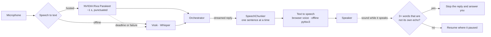
```mermaid
flowchart LR
  MIC[Microphone] --> STT{Speech to text}
  STT -->|hosted| RIVA["NVIDIA Riva Parakeet<br/>~1 s, punctuated"]
  STT -->|offline| LOCAL["Vosk · Whisper"]
  RIVA -.->|"deadline or failure"| LOCAL
  RIVA --> ORC[Orchestrator]
  LOCAL --> ORC
  ORC -->|streamed reply| CHUNK["SpeechChunker<br/>one sentence at a time"]
  CHUNK --> TTS["Text to speech<br/>browser voice · offline pyttsx3"]
  TTS --> SPK[Speaker]
  SPK -.->|"sound while it speaks"| BARGE{"3+ words that are<br/>not its own echo?"}
  BARGE -->|yes| STOP[Stop the reply and answer you]
  BARGE -->|no| RESUME[Resume where it paused]
```

- **Engines.** `LAPTOP_AGENT_STT=auto` prefers hosted Parakeet (gRPC, ~1 s against
  Whisper's ~10 s on the same clip), then Vosk when a model is present, else Whisper. A
  failed cloud call falls through to a local engine, so losing the network costs quality,
  not the transcription. Chrome/Edge tabs can use the browser's own recognizer; the native
  window records and transcribes on the server.
- **It starts talking early.** The reply is carved into sentences as it streams, so the
  first sentence is spoken while the rest is still being written.
- **Barge-in listens to level, then to words.** While it speaks, sustained sound above the
  learned echo pauses playback; only three or more words that are not its own voice stop
  the reply. A cough resumes it. **Space** is the manual interrupt. The meter in the
  presence panel shows what the microphone hears against the level it must beat, and
  **Voice cut-in level** in the settings tunes it to your room.
- **Hosted speech has a deadline** (5 s plus half the clip, 10–120 s,
  `RIVA_ASR_TIMEOUT_SECONDS` overrides). On timeout the RPC is cancelled and `auto` tries
  the local engine; the timeout is recorded under `transcribe/riva-timeout`.
- Voice needs `localhost` or HTTPS: plain-HTTP LAN access cannot reach the microphone.

### Voice notes

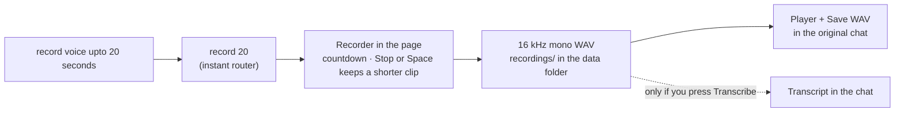
```mermaid
flowchart LR
  ASK["record voice upto 20 seconds"] --> R["record 20<br/>(instant router)"]
  R --> UI["Recorder in the page<br/>countdown · Stop or Space keeps a shorter clip"]
  UI --> WAV["16 kHz mono WAV<br/>recordings/ in the data folder"]
  WAV --> PLAY["Player + Save WAV<br/>in the original chat"]
  WAV -.->|"only if you press Transcribe"| TXT["Transcript in the chat"]
```

Ask in the app or web page: "record my voice for 10 seconds", "record a voice note"
(20 s), "record audio up to 2 minutes" (the maximum), "can you record my voice for twenty
seconds?". A clip stays in `recordings/`; it is never swept as a temporary upload.
Transcription is optional and uses the configured speech engine, which may be hosted.
Voice notes are developer-only for now: a recording has no owner account yet.

---

## Accounts & sign-in

Optional. With no accounts the app behaves as before. Once one exists, every request
needs a sign-in — this computer's included.

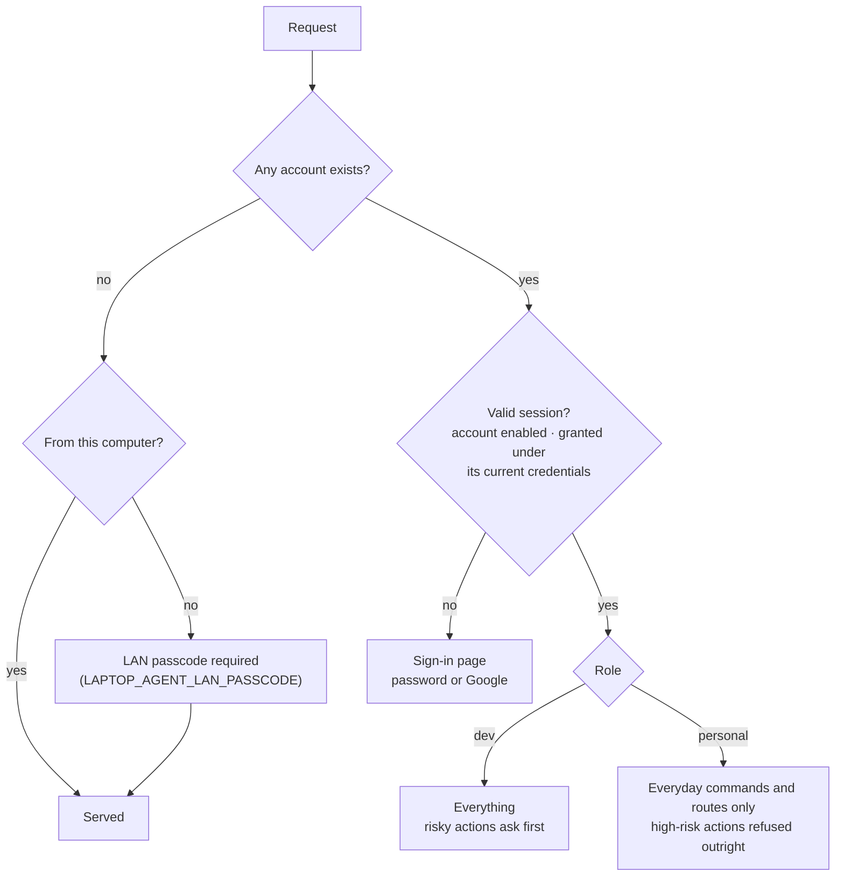
```mermaid
flowchart TD
  REQ[Request] --> ANY{Any account exists?}
  ANY -->|no| LOOP{From this computer?}
  LOOP -->|yes| OK[Served]
  LOOP -->|no| PASS["LAN passcode required<br/>(LAPTOP_AGENT_LAN_PASSCODE)"] --> OK
  ANY -->|yes| SESS{"Valid session?<br/>account enabled · granted under<br/>its current credentials"}
  SESS -->|no| SIGNIN["Sign-in page<br/>password or Google"]
  SESS -->|yes| ROLE{Role}
  ROLE -->|dev| DEV["Everything<br/>risky actions ask first"]
  ROLE -->|personal| PER["Everyday commands and routes only<br/>high-risk actions refused outright"]
```

```powershell
python -m laptop_agent.accounts create jeevan --role dev
python -m laptop_agent.accounts create family --role personal
```

| Role | Can | Cannot |
|---|---|---|
| `dev` | everything; risky actions raise an approval card | — |
| `personal` | chat, web search, research, the advisor, reminders, timers, lists, weather, news, maps, pictures and documents | files, the screen, the camera, apps, windows, the shell, the browser or music on this laptop; mail, notes, indexed documents, job search; diagnostics; anything that acts on its own (agent mode, schedules, workflows) |

- **Passwords** are stdlib scrypt (N=2^17); every refusal costs one hash, so timing does not
  reveal who exists, and at most two hashes run at once.
- **Sessions** are server-side, stored as hashes of the token, last up to 30 days (7 without
  use), and are **bound to the credentials they were granted under**: a password change or
  a disable ends them, including one created by a sign-in that was mid-hash when the change
  landed, and stops any agent run or workflow still running under them at its next step.
- **Managing accounts** — **Manage accounts** in the settings popover (this computer only;
  every change asks your password again), or the same `python -m laptop_agent.accounts`
  command, which also resets passwords, so a forgotten one never locks the owner out.
- A **personal** account is meant as you in a safer everyday mode: reminders, timers, lists
  and remembered facts are shared, not kept per account.
- Damaged sign-in storage **fails closed** (503 with recovery steps) rather than switching
  sign-in off.

### Google sign-in

Link a Google identity to an existing local account in Settings (your password is asked
again), then use **Sign in with Google** on this computer. It never creates an account or
changes a role, uses `openid email profile` only, and does **not** connect Gmail. You need
a Google OAuth **Desktop app** client in `GOOGLE_CLIENT_ID` / `GOOGLE_CLIENT_SECRET`; the
callback is `http://127.0.0.1:<app-port>/auth/google/callback`, derived from the port.

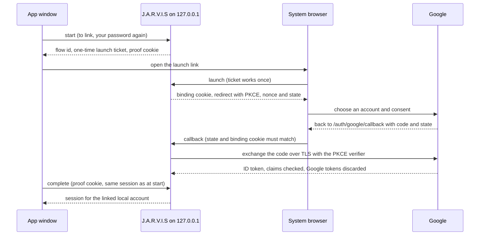
```mermaid
sequenceDiagram
  participant W as App window
  participant A as J.A.R.V.I.S on 127.0.0.1
  participant S as System browser
  participant G as Google
  W->>A: start (to link, your password again)
  A-->>W: flow id, one-time launch ticket, proof cookie
  W->>S: open the launch link
  S->>A: launch (ticket works once)
  A-->>S: binding cookie, redirect with PKCE, nonce and state
  S->>G: choose an account and consent
  G-->>S: back to /auth/google/callback with code and state
  S->>A: callback (state and binding cookie must match)
  A->>G: exchange the code over TLS with the PKCE verifier
  G-->>A: ID token, claims checked, Google tokens discarded
  W->>A: complete (proof cookie, same session as at start)
  A-->>W: session for the linked local account
```

Unlinking asks your password and signs out the account's other sessions. Google failures
are recorded without the code, client secret or tokens, and a refused client
(`invalid_client`) names the settings to check instead of saying "start again".

### From a phone on your own network

The page carries the API token, and that token is shell, files and mail on this laptop —
so a non-loopback bind is refused unless a passcode (or an account) protects it:

```powershell
$env:LAPTOP_AGENT_HOST="0.0.0.0"; $env:LAPTOP_AGENT_LAN_PASSCODE="something-long"
python -m laptop_agent.webui        # then http://<laptop-ip>:8770 on the phone
```

Anything that is not this machine gets a plain lock screen, exchanges the passcode for an
HttpOnly `SameSite=Strict` cookie, and is rate limited. The `Host` must be an **IP literal**,
never a name, so DNS rebinding cannot reach it. On Windows, allow the port for your own
subnet only:

```powershell
New-NetFirewallRule -DisplayName "J.A.R.V.I.S (LAN)" -Direction Inbound -Action Allow `
  -Protocol TCP -LocalPort 8770 -RemoteAddress LocalSubnet -Profile Any
```

LAN mode is plain HTTP: use it only on a network you trust. Voice does not work over it.

---

## Security & approvals

Only **external state changes** and **data egress** are confirmed:

| Risk | Examples |
|---|---|
| none / low | read, search and summarize local files, knowledge recall, vault read/write |
| medium | web search, inbox read, research (one approval covers the fetch fan-out), arranging desktop windows |
| high | send email, write/convert/move files, downloads, launch apps, browser state changes |
| critical | SMTP/OAuth send, OAuth token exchange, terminal commands |

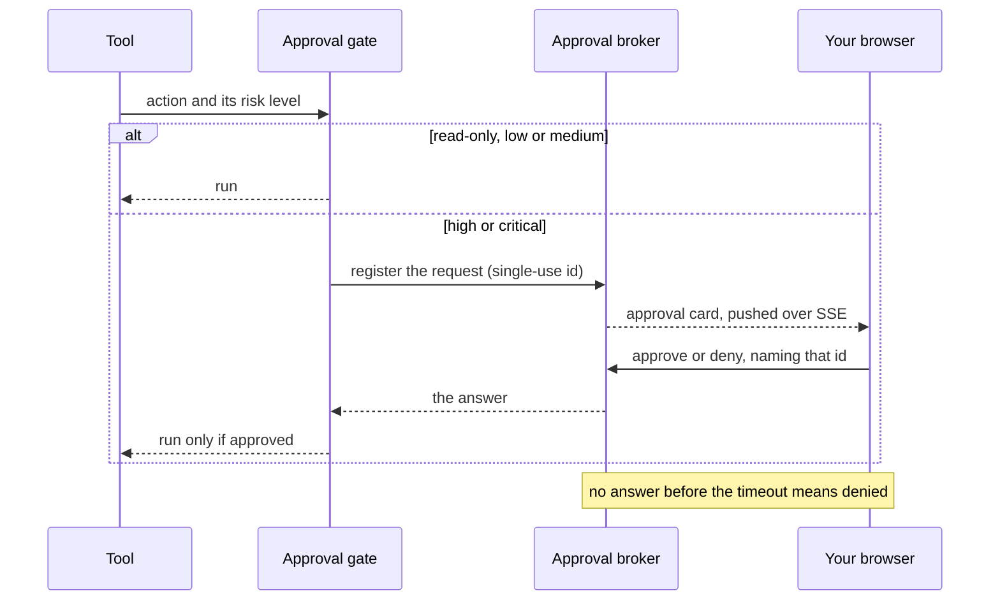
```mermaid
sequenceDiagram
  participant T as Tool
  participant G as Approval gate
  participant B as Approval broker
  participant P as Your browser
  T->>G: action and its risk level
  alt read-only, low or medium
    G-->>T: run
  else high or critical
    G->>B: register the request (single-use id)
    B-->>P: approval card, pushed over SSE
    P->>B: approve or deny, naming that id
    B-->>G: the answer
    G-->>T: run only if approved
  end
  Note over B,P: no answer before the timeout means denied
```

- `autopilot` is restricted to a read-only allowlist; `agent run` can act, but risky steps
  still hit the gate.
- With no interface connected to answer, a risky action is denied at once rather than left
  hanging. A `personal` account is refused high-risk actions before anyone is asked, and
  sees only its own approval cards.
- Audit events go to `.agent_data/audit.jsonl`; swallowed failures to `failures`.
- **Local-first.** The server binds to loopback with origin checks and a per-process API
  token; pages carry a nonce Content-Security-Policy and load nothing from a CDN. Secrets
  live only in the gitignored `.env`.

---

## Configuration

Copy `.env.example` → `.env` (gitignored, auto-loaded; real environment variables win).
Everything is optional — **System status → Setup** says which of these a capability needs.

| Group | Key(s) | Notes |
|---|---|---|
| **LLM brain** | `LAPTOP_AGENT_LLM_PROVIDER=openai`, `OPENAI_API_KEY`, `OPENAI_BASE_URL`, `OPENAI_MODEL` | Any OpenAI-compatible API. Leave the provider `heuristic` for offline. |
| **Model tiers** | `OPENAI_SMART_MODEL`, `OPENAI_ULTRA_MODEL`, `OPENAI_VISION_MODEL`, `OPENAI_REASONING_BUDGET` | Picked automatically by task complexity. |
| **Pictures** | `OPENAI_IMAGE_MODEL`, `OPENAI_IMAGE_KEY`, `OPENAI_IMAGE_BASE_URL`, `OPENAI_IMAGE_FALLBACK_MODEL` / `_KEY` | A different host from chat — never point `OPENAI_BASE_URL` at it. |
| **Embeddings** | `OPENAI_EMBED_MODEL`, `OPENAI_EMBED_KEY` | Default to the chat host and key. |
| **Backup provider** | `OPENROUTER_API_KEY`, `OPENROUTER_MODEL`, `OPENROUTER_BASE_URL` | Tried after every primary tier. |
| **Speech** | `LAPTOP_AGENT_STT=auto`, `RIVA_API_KEY`, `RIVA_SERVER`, `RIVA_ASR_FUNCTION_ID`, `RIVA_ASR_LANGUAGE`, `RIVA_ASR_TIMEOUT_SECONDS`, `VOSK_MODEL` | Riva selects a model by **function id**, never a model name; the key falls back to `OPENAI_API_KEY`. |
| **OCR** | `LAPTOP_AGENT_OCR=auto\|parse\|tesseract` | `auto`: hosted `nemotron-parse` when a key is set, else Tesseract. |
| **Web search** | `SEARCH_PROVIDER`, `SEARCH_API_KEY` (or `BRAVE_API_KEY` / `SERPER_API_KEY` / `SERPAPI_API_KEY`) | No key → DuckDuckGo; an API falls back to DuckDuckGo too. |
| **Email** | `SMTP_*`, `IMAP_*`, `MICROSOFT_CLIENT_*` | Drafts need nothing; SMTP/IMAP (a Gmail app password) or OAuth unlock send/read. |
| **Google sign-in** | `GOOGLE_CLIENT_ID`, `GOOGLE_CLIENT_SECRET` | A Desktop OAuth client. `GOOGLE_REDIRECT_URI` belongs to the older email OAuth only. |
| **Memory** | `OBSIDIAN_VAULT` | The vault root (where `.obsidian` lives). |
| **Job search** | `JOBRIGHT_EMAIL`, `JOBRIGHT_PASSWORD`, `JOBRIGHT_MAX_YEARS`, `JOBRIGHT_MIN_MATCH`, `BROWSER_USER_DATA_DIR` | Jobright login (session-cached) and lead filtering. |
| **Server** | `LAPTOP_AGENT_HOST`, `LAPTOP_AGENT_PORT` (8770), `LAPTOP_AGENT_LAN_PASSCODE`, `LAPTOP_AGENT_DATA_DIR` | Loopback by default; a non-loopback bind needs a passcode. |

---

## Optional extras

Heavy capabilities are opt-in; without an extra, the command returns a clear install hint
instead of failing.

```powershell
pip install -e ".[app,voice,riva,stt,transcribe,ocr,docs,browser,desktop,youtube,metrics,vision]"
python -m playwright install chromium    # for the browser extra
```

| Extra | Enables |
|---|---|
| `app` | native pywebview desktop window |
| `voice` | offline text-to-speech + speech recognition |
| `riva` | hosted NVIDIA Parakeet speech-to-text (gRPC) |
| `stt` / `transcribe` | lightweight offline Vosk / Whisper *(needs ffmpeg)* |
| `ocr` | Tesseract OCR *(needs the Tesseract program on PATH)* |
| `docs` | PDF/DOCX reading (pdfplumber, pypdf) and Word/PowerPoint output |
| `browser` | Playwright form inspect/fill · Jobright scraper · PDF export of documents and résumés |
| `desktop` | screenshots, app and media-key control |
| `youtube` · `metrics` · `vision` | transcripts · CPU/GPU stats · webcam |

---

## Web API

The page talks to a small JSON/SSE API on the same origin. Every mutation needs the
per-process token and a matching origin; with accounts, a session too.

| Route | Purpose |
|---|---|
| `POST /api/stream` · `/api/command` · `/api/agent` | A chat turn (SSE, with spoken-sentence events in voice mode) · one command (JSON) · an autonomous agent run (SSE trace) |
| `GET /api/health` · `/api/setup` · `/api/metrics` · `/api/traces` · `/api/failures` | Health · the Setup report · CPU/RAM/GPU · latency traces · the failure log |
| `/api/reminders` · `/api/schedule` · `/api/agent-runs` · `/api/agents` | Due reminders · scheduled jobs · agent-run history · the control room |
| `/api/approvals` · `/api/approve` · `/api/cancel` | Pending approval cards · answer one · stop a running turn |
| `/api/map` · `/api/trip` · `/api/notes` · `/api/vault` | Map · trip planner · the memory-vault browser |
| `/api/upload` · `/api/image` · `/api/document` | Attachments · generated pictures · generated documents |
| `/api/recordings` · `/api/recording` · `/api/recordings/transcribe` | Save a voice note · play/download it · transcribe it on request |
| `/api/transcribe` · `/api/tts` · `/api/window` | Server speech-to-text · offline speech · native window effects |
| `/api/jobs` · `/api/pipeline` · `/api/copilot` · `/api/resume-pdf` | Job tracker · pipeline board · résumé CoPilot · PDF export |
| `/api/me` · `/api/accounts` · `/api/pair` | Who is signed in · account management (this computer only) · LAN passcode |
| `/auth/login` · `/auth/logout` · `/auth/password` · `/auth/bootstrap` · `/auth/google/*` | Sign-in, sign-out, password change, first account, Google sign-in |

---

## Project layout

```text
src/laptop_agent/
  agents/orchestrator.py     Core router: text → one tool or a streamed chat reply
  agents/control_room.py     The specialist roster shown in the app
  planner/                   heuristic.py (instant) · openai_compatible.py (LLM tiers) · core.py
  tools/                     One module per capability: files, file_processor, web, websearch,
                             research, news, weather, travel, email, obsidian, youtube,
                             transcribe (OCR + speech), webcam, desktop, windows, music, browser,
                             terminal, imagegen, document, calculator, units, dates, chance,
                             clock, textcard, jobright, resume_pdf
  accounts.py  sessions.py   Accounts (scrypt) · server-side sessions bound to their credentials
  access.py  google_oidc.py  What a personal account may do · Google sign-in (OIDC + PKCE)
  safety.py  approvals.py    The risk-classified gate · approval cards in the browser
  audit.py  failures.py      JSONL audit log · the log of every swallowed failure
  tracing.py  model_status.py  Per-turn latency · per-tier busy/broken health
  health.py  metrics.py      Health + the Setup report · CPU/RAM/GPU usage
  knowledge.py  embeddings.py  TF-IDF index fused with vectors (reciprocal rank fusion)
  memory.py  context.py  terms.py  Profile, facts and lists · session context · shared tokenizer
  advisor.py  reasoning.py   The `solve` advisor · autonomous plan/act/observe loop
  autopilot.py  workflows.py  tasks.py  Safe autopilot · workflows · parallel tasks
  scheduler.py  reminders.py  timeparse.py  Recurring jobs · reminders, timers, alarms · DST-safe times
  recordings.py  voice.py    Voice notes · sentence chunking and cleanup for speech
  copilot.py  jobs.py        Résumé CoPilot (ATS + grounded tailoring) · the job pipeline
  storage.py  retention.py   Atomic, locked JSON stores · cleanup of generated files
  token_vault.py  config.py  DPAPI-encrypted OAuth tokens · `.env` and settings
  selfcheck.py               The routing contract: phrasings that must reach their tools
  cli.py  gui.py  dashboard.py  webui.py  Front ends: CLI, Tkinter, web and native
  webui_page.py  webui_assets/  Page loader · app.html, app.css, app.js, signin.html, google_auth.js
  window_fx.py  cancellation.py  app.py  Native window effects · Stop · the one place everything is wired
packaging/                   PyInstaller builds of JARVIS.exe (full, and small with Vosk)
docs/screenshots/            The images in this README
tests/                       Dependency-free unittest suite + opt-in Chromium suites
```

---

## Testing & CI

```powershell
python -B tests/run_tests.py                       # the whole unit suite, offline
python -B tests/run_tests.py test_planner.py       # one file
$env:JARVIS_BROWSER_TESTS = "1"
python -B tests/run_tests.py "test_browser_*.py"   # Chromium suites (needs playwright + pypdf)
```

- The runner ignores your personal `.env`, uses temporary data, blocks outbound Python
  sockets, and makes `os.startfile`, `webbrowser.open` and the volume keys inert, so on
  Windows a local run never opens a browser tab or touches the desktop.
- A failing run writes `test-failures.log` (every test id and traceback) and names it as
  the last line of output.
- **CI** runs the unit suite on Windows and Linux × Python 3.11 and 3.13 (1,600 tests), and
  every Chromium suite in a separate job (80 tests): routing, chat, accounts and roles,
  Google sign-in against a fake Google, reminders, voice notes, layout at several sizes.
- `self check` in the app runs the routing contract against the real router: every
  phrasing in it must reach its tool, and every near miss must stay chat.

---

## Packaging (`JARVIS.exe`)

```powershell
pip install pyinstaller pywebview pyttsx3
./packaging/build_app.ps1          # full build → dist/JARVIS.exe
./packaging/build_app_small.ps1    # Vosk instead of Whisper/PyTorch: ~162 MB, boots in ~3 s
```

A single windowless executable that opens a native window (WebView2, built into Windows
11). See [packaging/README.md](packaging/README.md).

---

## Reliability notes

- **Single-user, local-first.** Mutations need the per-process token and a matching origin.
  In the web app a high-risk action raises an approval card; the CLI asks in the terminal
  and the Tkinter app in a dialog.
- **Keep the port stable** (default 8770): native chat history lives in a persistent webview
  profile keyed to it. A second instance on the same port is refused at startup.
- **Stop** cancels the backend request and prevents later steps; active model streams are
  interrupted where their socket allows. A tool already inside a blocking external call may
  finish or time out first, and completed actions are not undone.
- **Storage.** JSON stores are written atomically under file locks, keep a previous-version
  `.bak`, and preserve malformed JSON as `.corrupt-*`. Sign-in storage is the exception: it
  fails closed and is never restored from a backup, which could revive a deleted account or
  a revoked session.
- **Schedules run only while the app runs.** Due work is claimed durably before it runs; a
  crash leaves a `running` claim rather than risk a duplicate — after checking its effects,
  disable and re-enable the schedule.
- **Model health.** A busy tier is retried in 60 s; a broken one (bad key, retired model) is
  skipped for 15 minutes, survives a restart, and is named in Setup with what to change.
- **Job search.** Application counts exclude unsubmitted leads; résumé keyword scores are
  estimates, not an employer's ATS. Tailoring quotes only supported excerpts and real
  repository links; review cover-letter and interview drafts before use. PDF export needs
  Playwright and publishes only a verified single Letter page.
- **Owner checks still owed:** a real Google Desktop-client sign-in, a physical-microphone
  voice note and voice session, and packaged-installer runs; Jobright, email, model
  providers and camera hardware each need their own configured check.

See [REVIEW_REPORT.md](REVIEW_REPORT.md) for the feature inventory, review findings,
remediation evidence and remaining limits.

---

## License

Released under the [MIT License](LICENSE).
