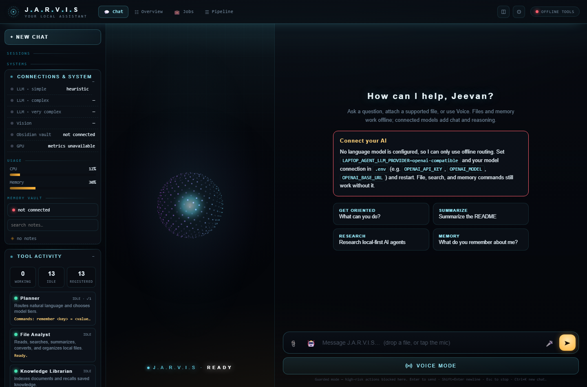
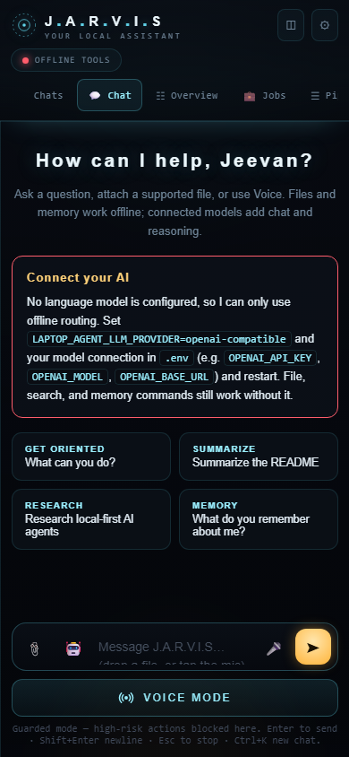

# J.A.R.V.I.S review and remediation

Reviewed: 2026-09-08. Baseline: version 0.39.0. Requested target: at least 8.5/10 for a dependable local, single-user assistant.

## Baseline assessment

Overall: **6/10**. Feature breadth 8, architecture 6, desktop presentation 7, everyday usability 5, reliability 5, security 3, automated testing 7, distribution readiness 4 (all out of 10).

Scope: 53 Python source files / approximately 14,645 lines; 46 test files. All **488 existing tests passed**. All 99 source/test files parsed. The four web pages rendered without startup JavaScript errors. Additional tests used isolated temporary data, mocked side effects and a local browser. The initial review changed no project or personal application data.

Not validated live: paid model output, email delivery, authenticated Jobright scraping, microphone/camera hardware, and the packaged executable. Scores are engineering judgments, not benchmarks. Passing offline tests does not establish that every external integration works.

## Feature inventory

| Area | Implemented capabilities |
| --- | --- |
| Interfaces | CLI; basic Tkinter GUI; Tkinter dashboard; browser app; native pywebview; Chrome/Edge app-window fallback; Windows executable build scripts. |
| Chat | Offline heuristic and explicit-command routing; OpenAI-compatible provider; fast/smart/ultra/vision tiers; OpenRouter fallback; profile and conversation context; streaming; freshness detection, web grounding and stale-answer notices. |
| Files | Directory scanning; reading/search; metadata; PDF/DOCX extraction; extractive summaries and Q&A; file-type dispatch; CSV/TSV statistics; CSV/TSV/Markdown table extraction; conversion/writing; folder organization; downloads. |
| Knowledge | Manual/automatic indexing; TF-IDF search; local answers; list/stats/export/forget/clear. |
| Obsidian/memory | Profile facts and notes; vault status/list/read/search; aliases; outlinks/backlinks; link-aware answers; vault audit; note creation and rolling memory. |
| Research | DuckDuckGo/Brave/Serper/SerpApi; fallback; page fetching; summaries and Markdown reports; saving; researched decision assistance. |
| Autonomy | Plan/act/observe loop, step limits, run history and traces; fixed safe autopilot plans; multiple subtasks and retry; sequential workflows and recovery. |
| Productivity | Interval/daily command or agent schedules; enable/disable/remove/due execution; reminder storage/upcoming/due/completion; daily briefing. |
| Jobs | Seven pipeline stages; records/stage changes/removal; recruiter, notes and next-date fields; charts; Jobright session login, interception/DOM scraping, descriptions, filtering, deduplication and import. |
| Resumes | Keyword scoring/missing keywords; tailored bullets, cover letters and interview packs; base resume storage/import; tailored HTML; repository links; PDF export/download/preview. |
| Email | Mailto drafts; SMTP/attachments; IMAP inbox/search/digest; Gmail/Outlook OAuth authorize/exchange/refresh/status/forget; API read/draft/send; Windows DPAPI tokens. |
| Computer/browser | Page/form inspection; profile mappings; fill previews and approved filling; application preparation; app/file/URL launch; screenshots; terminal timeout/output capture. |
| Media/voice | OCR; image/screen/webcam interpretation; Whisper/Vosk; YouTube transcripts/summaries; TTS; browser dictation/native voice loop; media keys, local media and YouTube search. |
| Travel | Weather/forecast; geocoding; driving distance/ETA; multi-stop routes; maps/directions; nearby places; approximate IP location. |
| UX/operations | Four pages; sessions/attachments/Markdown/typewriter; animated sphere; tool activity panels; maps/trips/vault/schedules/history; compact/opacity/topmost; CPU/RAM/GPU/VRAM; health/audit. |

## Findings and work queue

The baseline findings are preserved below. Fixed means the reported defect was addressed and its applicable validation passed; it does not certify every external integration.

| ID | Priority | Baseline finding and reproduction | Status |
| --- | --- | --- | --- |
| R01 | High | Markdown URL quote injection created an executable event attribute; harmless browser marker executed. | Fixed — browser injection regression + nonce CSP |
| R02 | High | A text/plain POST with an unrelated Origin changed temporary job data; no server origin/auth boundary. | Fixed — origin/Host/token/content-type tests; loopback enforced |
| R03 | High | Medium-risk app launch was automatically approved in guarded web/native mode (mocked launcher). | Fixed — high-risk gate blocks mocked OS launch |
| R04 | High | `autopilot workflow knowledge clear` erased a temporary index; broad safe prefixes also accept nested agents. | Fixed — exact safe-command allowlist regression |
| R05 | High | Fabricated employer/title/dates/achievement passed resume grounding with no flags. | Fixed — unsupported fields/prose rejected; source-excerpt validation |
| R06 | High | Corrupt memory crashes loading; stores use direct overwrites and inconsistent synchronization. | Fixed — atomic writes, backups, recovery copies, file locks; concurrent instances tested |
| R07 | Medium | Switching chats during a reply saved the answer into the new chat. | Fixed — browser switches chats during delayed reply; original session owns answer |
| R08 | High | Browser Stop disconnects but backend work continues; emitters swallow disconnect errors. | Fixed — backend cancellation, stream interruption and step/gate checks; limits below |
| R09 | Medium | Native random port changes the localStorage origin, separating chats/settings on restart. | Fixed — configured stable port and persistent native profile; backend contract tested |
| R10 | High | Concurrent due runners executed one scheduled command twice. | Fixed — durable exclusive due claims; concurrent store instances tested |
| R11 | Medium | Same-named uploads overwrite; voice inputs share one filename. | Fixed — unique upload directories and disposable recording files; API regressions |
| R12 | Medium | JSON array payload caused AttributeError and disconnected HTTP response; body shape unvalidated. | Fixed — validated object/string/list/history shapes return HTTP errors |
| R13 | Medium | Malformed model resume structures crash rendering. | Fixed — malformed structures rejected before export; defensive renderer tested |
| R14 | High | Default tailored resume omitted email/phone; profile fields have no normal editor. | Fixed — source contacts retained and profile editor round-trips in browser |
| R15 | Medium | Re-tailoring retained old PDF path, allowing stale downloads after export failure. | Fixed — invalidation plus version-checked, content-specific exports |
| R16 | Medium | C++/C#/Python explicitly present scored only 33%; C# is dropped during extraction. | Fixed — symbol-aware keyword boundaries; C++/C#/Python regression scores 100% |
| R17 | Medium | Leads inflate application totals/trends; rejection erases historical interview/response metrics. | Fixed — applications exclude leads; application dates and furthest stage persist |
| R18 | Medium | Unqualified reminder times become UTC instead of local time. | Fixed — naive times interpreted locally; explicit offsets preserved |
| R19 | Medium | Host/port constants are read before .env loading. | Fixed — configuration loads before HTTP host/port settings |
| R20 | Medium | Mid-stream timeout propagates instead of triggering model fallback. | Fixed — stream transport failures reset partial display and allow fallback |
| R21 | Medium | Blocking synchronous tool operations run sequentially despite asyncio.gather. | Fixed — up to four worker threads; barrier test proves overlapping blocking work |
| R22 | Medium | Multi-task result reports success when every child fails. | Fixed — partial/all failures produce failed aggregate status and per-task detail |
| R23 | Medium | At 390px, page becomes 719px wide and composer begins outside viewport. | Fixed — all views fit 390/700/1100/1440px; mobile chat drawer added |
| R24 | Medium | Native voice stop lacks direct microphone/audio cleanup; audio object URLs accumulate. | Fixed — direct capture/audio cleanup and URL revocation; browser regression |
| R25 | Low | 35MiB request limit caps base64 raw upload at roughly 26MiB. | Fixed — request envelope accounts for base64 expansion of 35MiB raw data |
| R26 | Medium | One-page resume promise has no page-count/overflow verification. | Fixed — independent PDF page count, overflow rejection and previous-file preservation |
| R27 | Medium | Misleading approval/setup guidance, readiness labels, silent panel errors and stale docs. | Fixed — readiness/setup/approval guidance, visible errors, current docs |
| R28 | Medium | No tracked CI; limited security, concurrency and browser regression coverage. | Fixed — isolated runner, regression suites and CI configuration added |
| R29 | Low | Visual density, inconsistent buttons, keyboard accessibility and reduced-motion gaps. | Fixed — focus states, semantic controls, mobile history, motion preference and static canvas |

## Capability limits to keep explicit

- Reminders store/list due items; they are not OS notifications. Schedules require a running web/native process; the CLI does not run the background ticker.
- The control room tracks tool categories, not independent agent processes. Offline autopilot uses fixed plans; open-ended planning needs a model.
- Spreadsheet analysis is CSV/TSV; table extraction is CSV/TSV/Markdown. Recognizing a file type does not imply full support.
- Offline summaries/Q&A select source sentences. ATS scores are keyword estimates, not employer ATS predictions.
- Form filling does not submit applications; music searches do not guarantee song playback.
- Web/native guarded mode blocks high-risk actions; CLI/Tkinter have interactive approvals.
- Jobright depends on third-party login/page behavior. Missing descriptions prevent complete fit validation.
- Token encryption, media keys and window effects have platform-specific support.
- Local-first does not mean all configured model, email, map or search requests stay offline.

## Remediation acceptance criteria

1. Close injection/approval holes and protect local HTTP endpoints.
2. Preserve personal data; use atomic storage and safe concurrency; test recovery and isolation.
3. Make cancellation, chat ownership, scheduled execution and aggregate status correct.
4. Reject malformed/unsubstantiated resume output, retain contacts, invalidate stale PDFs and verify export layout.
5. Provide usable desktop/narrow layouts, honest setup/errors and accessible controls.
6. Pass original plus targeted regression tests and isolated browser checks; document remaining external/hardware limits.
7. Reassess the final local-assistant score from evidence; do not raise the score just to meet the target.

## Validation and final assessment

**Final local-assistant rating: 8.5/10, up from 6/10.** The largest gains are closing
browser/approval holes, protecting stored data, and making previously unreliable
user flows deterministic. This is an engineering judgment for the existing
single-user local assistant, not a production-service certification.

| Dimension | Final score | Weight | Reason |
| --- | ---: | ---: | --- |
| Feature breadth | 8.5 | 10% | Broad existing capabilities retained; contact editing and mobile history added. |
| Architecture | 8.0 | 10% | Shared persistence and cancellation primitives; the large inline web module remains costly to maintain. |
| Presentation | 8.5 | 10% | Wider chat, verified narrow layouts, consistent controls, readable offline/setup states. |
| Everyday usability | 8.5 | 15% | Correct chat ownership, stable desktop history, accessible navigation and visible failure feedback. |
| Reliability | 8.5 | 25% | Atomic storage/recovery, exclusive schedules, correct aggregates, concurrent tasks, versioned exports. |
| Security | 8.5 | 20% | Injection regression closed, nonce CSP, loopback/origin/token boundary, app-launch approval and safe autopilot restrictions. |
| Automated testing | 9.0 | 10% | Isolated unit/API/concurrency tests plus real Chromium/PDF regressions and a CI workflow. |

Weighted result: **8.50/10**. Distribution readiness remains **6.5/10** separately:
this work did not build/sign/test a fresh installer or validate connected accounts.
The score would be lower if those release requirements were included in the target.

### Executed validation

- **530 tests passed, zero failures, zero skips**, using `JARVIS_BROWSER_TESTS=1`
  with `python -B tests/run_tests.py` on Windows / Python 3.14.
- All **105 Python files** in `src` and `tests` parsed as UTF-8 and under Python 3.11
  syntax rules. This syntax check does not replace executing the suite on Python 3.11.
- `git diff --check` passed.
- Nine actual Chromium tests covered: four pages at four viewport widths; executable
  Markdown/attachment attempts; delayed reply with chat switching; corrupt browser
  history; backend Stop; mobile history/suggestions; native audio cleanup; profile
  editing/persistence; and PDF generation/overflow. No startup JavaScript errors.
- PDF output was independently read with pypdf: one Letter page and retained contact
  text. An oversized input was rejected and its previous file remained unchanged.
- Persistence regressions covered 32 concurrent inserts through four store instances,
  distinct IDs, cross-instance memory updates, interrupted writes, corruption recovery,
  exclusive due claims and stale-export rejection.
- Integration test inputs were synthetic. The runner ignored personal `.env` settings,
  used temporary application data, and blocked external Python socket connections.
  Browser tests blocked external resources and mocked system metrics.
- CI now defines Windows/Linux unit jobs on Python 3.11/3.13 and a separate Chromium
  job. The remote CI workflow has **not** been executed during this local task.

### Remaining limits and tradeoffs

1. **Resume review remains necessary.** Exact source excerpts prevent new unsupported
   prose/factual values from being exported. They do not prove correct grouping,
   completeness of employment history, or semantic relevance. General cover-letter,
   bullet and interview drafts are explicitly marked for factual review. This stricter
   export mode may reject a useful paraphrase; it favors traceable content.
2. **Cancellation is cooperative.** Stop reaches the server and prevents later steps,
   approvals and fallback work. An HTTP model stream can be interrupted once its socket
   exists. A tool already inside a blocking external call may finish or time out first.
   Completed actions are not rolled back.
3. **Crash recovery is conservative.** A schedule claimed before a process crash stays
   marked `running` to avoid duplicating an uncertain action. Inspect its effects and
   disable/re-enable it to retry. Previous JSON backups can be one mutation behind;
   recovery warnings identify preserved corrupt copies for review.
4. **Old history cannot be invented.** Earlier rejected jobs lack historical stage data.
   Old native chats tied to random ports are not automatically migrated. Future native
   launches use the stable configured port/profile; changing the port changes the origin.
5. **Local trust boundary.** The HTTP app is restricted to loopback and has no separate
   user accounts. Its token protects browser mutations; it is not protection against
   a malicious process already running as the local user.
6. **External/hardware checks remain open.** Live model quality, SMTP/OAuth delivery,
   authenticated Jobright behavior, actual microphone/camera devices and the packaged
   executable were not exercised. Optional integrations still depend on provider and
   platform behavior. Fresh Windows/Linux CI execution and installer QA are release work.
7. **Maintainability.** The web interface remains a large Python-embedded HTML/JS file.
   A later module split would help maintainability but was not necessary to fix these defects.

### Changed files

| Files | Change |
| --- | --- |
| `REVIEW_REPORT.md` | Baseline inventory, all 29 findings, status, evidence and honest final score. |
| `src/laptop_agent/storage.py` | File locks, atomic replacement, previous-version backup and corrupt-byte preservation. |
| `src/laptop_agent/cancellation.py` | Request contexts, early-cancel handling, checkpoints and stream socket interruption. |
| `src/laptop_agent/webui.py` | HTTP boundary, validated payloads, cancellation API, unique uploads/recordings, persistent desktop profile, chat/voice/layout/profile/accessibility fixes. |
| `src/laptop_agent/agents/orchestrator.py` | Cancellation propagation, model fallback, concurrent batches, honest aggregate status, schedule claims and resume version checks. |
| `src/laptop_agent/copilot.py` | Symbol-aware keywords, strict export provenance, shape checks, sanitized contacts and explicit draft-review notice. |
| `src/laptop_agent/tools/resume_pdf.py` | Offline rendering, verified one-page output and atomic publishing. |
| `src/laptop_agent/jobs.py` | Safe persistence, furthest-stage/application-date metrics and stale-content/export invalidation. |
| `src/laptop_agent/memory.py` | Safe persistence, reload on shared updates and resilient profile/notes loading. |
| `src/laptop_agent/knowledge.py` | Locked atomic index operations and safer stored-entry handling. |
| `src/laptop_agent/reminders.py` | Locked persistence and local-time interpretation. |
| `src/laptop_agent/scheduler.py` | Locked persistence and durable exclusive due claims. |
| `src/laptop_agent/tasks.py`, `workflows.py` | Synchronized persistent run histories. |
| `src/laptop_agent/autopilot.py` | Exact safe-command matching and synchronized run history. |
| `src/laptop_agent/reasoning.py` | Cancellation checkpoints and synchronized autonomous-run history. |
| `src/laptop_agent/token_vault.py`, `audit.py` | Serialized vault mutations and audit writes; atomic JSON vault updates. |
| `src/laptop_agent/safety.py`, `tools/desktop.py` | Cancellation-aware serialized approvals and high-risk app launch. |
| `src/laptop_agent/planner/openai_compatible.py`, `health.py` | Interruptible model streams, honest reachability and storage recovery warnings. |
| `tests/run_tests.py`, `test_security_regressions.py`, `test_reliability_regressions.py`, `test_browser_regressions.py` | Isolated execution and targeted regression suites. |
| `tests/test_copilot.py`, `test_jobs.py`, `test_orchestrator.py` | Supported-source fixtures and regressions for changed behavior. |
| `tests/test_webui_*.py` (11 API test files) | Authenticated requests and corrected HTTP expectations. |
| `.github/workflows/ci.yml` | Unit matrix and optional-dependency browser job. |
| `README.md`, `CLAUDE.md`, `MEMORY.md`, `ERRORS.md` | Current operating instructions, constraints, decisions and regression lessons. |
| `docs/review/desktop.png`, `mobile.png` | Screenshots from isolated browser verification (synthetic metrics). |

Changes are on `codex/review-stabilization`, uncommitted and ready for review.
Personal configuration, credentials, vault contents and application data were not edited.
No deployment, outbound messages or release publication was performed.

### Visual evidence

Desktop, 1440px, with reduced motion:

Mobile, 390px:

